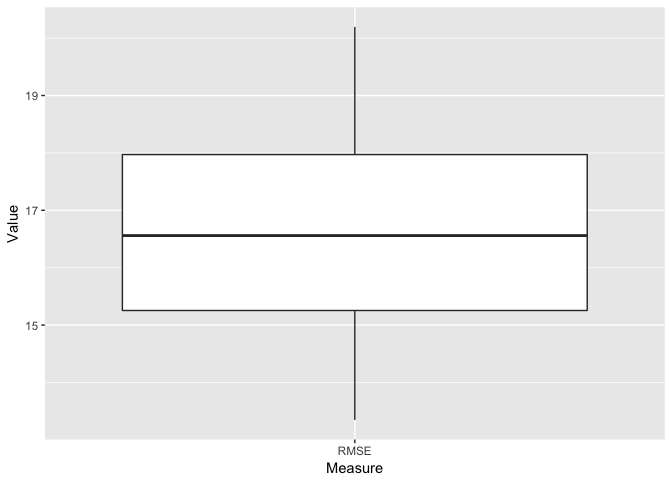
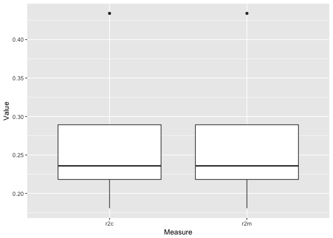
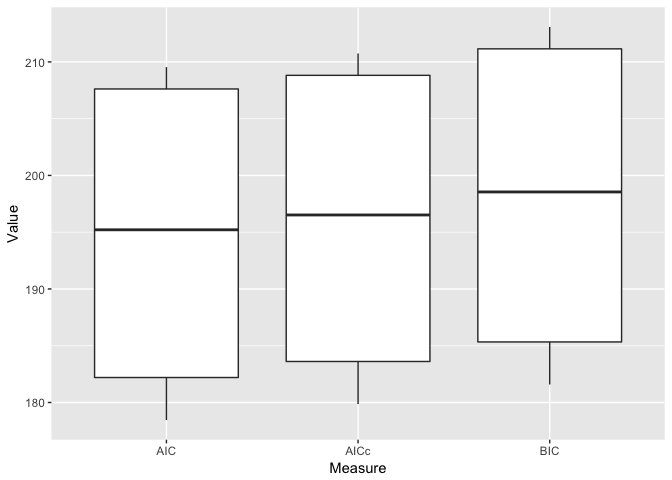
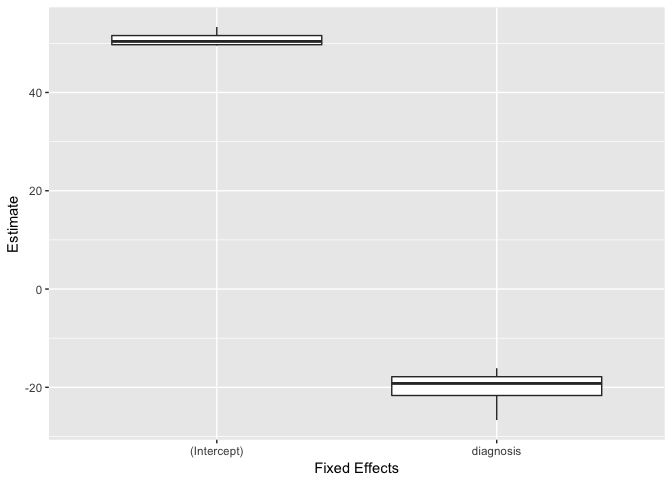
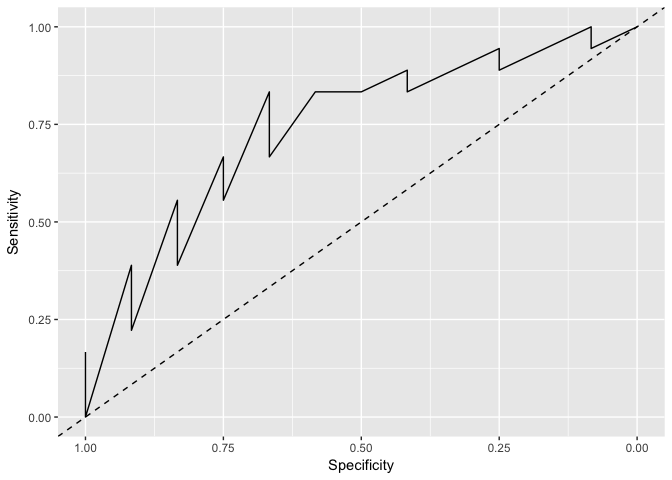

<!-- README.md is generated from README.Rmd. Please edit that file -->
cvms
====

**Cross-Validation for Model Selection**

R package: A set of functions for cross-validating gaussian and binomial regression models.

By Ludvig R. Olsen and Benjamin Zachariae,
Cognitive Science, Aarhus University.
Started in Oct. 2016

Contact at: <r-pkgs@ludvigolsen.dk>

Main functions:

-   cross\_validate()
-   cv\_plot()

Installation
------------

Development version:

> install.packages("devtools")
>
> devtools::install\_github("LudvigOlsen/groupdata2")
>
> devtools::install\_github("LudvigOlsen/cvms")

Examples
========

Attach packages
---------------

``` r
library(cvms)
library(groupdata2) # fold()
library(knitr) # kable()
library(dplyr) # %>% arrange()
```

Load data
---------

The dataset participant.scores comes with cvms.

``` r
data <- participant.scores
```

Fold data
---------

Create a grouping factor for subsetting in folds using groupdata2::fold(). Order the dataset by the folds.

``` r
# Set seed for reproducibility
set.seed(7)

# Fold data 
data <- fold(data, k = 4,
             cat_col = 'diagnosis',
             id_col = 'participant') %>% 
  arrange(.folds)

# Show first 15 rows of data
data %>% head(15) %>% kable()
```

| participant |  age|  diagnosis|  score|  session| .folds |
|:------------|----:|----------:|------:|--------:|:-------|
| 9           |   34|          0|     33|        1| 1      |
| 9           |   34|          0|     53|        2| 1      |
| 9           |   34|          0|     66|        3| 1      |
| 7           |   43|          1|     11|        1| 1      |
| 7           |   43|          1|     35|        2| 1      |
| 7           |   43|          1|     41|        3| 1      |
| 4           |   21|          0|     35|        1| 2      |
| 4           |   21|          0|     50|        2| 2      |
| 4           |   21|          0|     78|        3| 2      |
| 1           |   20|          1|     10|        1| 2      |
| 1           |   20|          1|     24|        2| 2      |
| 1           |   20|          1|     45|        3| 2      |
| 6           |   31|          1|     14|        1| 2      |
| 6           |   31|          1|     25|        2| 2      |
| 6           |   31|          1|     30|        3| 2      |

Cross-validate a single model
-----------------------------

### Gaussian

``` r
CV1 <- cross_validate(data, "score~diagnosis", 
                     folds_col = '.folds', 
                     family='gaussian', 
                     REML = FALSE)

# Show results
CV1
#> # A tibble: 1 × 13
#>       RMSE       r2m       r2c      AIC     AICc      BIC Folds
#>      <dbl>     <dbl>     <dbl>    <dbl>    <dbl>    <dbl> <int>
#> 1 16.66528 0.2716369 0.2716369 194.6045 195.9104 197.9384     4
#> # ... with 6 more variables: `Convergence Warnings` <int>, Family <chr>,
#> #   Results <list>, Coefficients <list>, Dependent <chr>, Fixed <chr>
```

### Binomial

``` r
CV2 <- cross_validate(data, "diagnosis~score", 
                     folds_col = '.folds', 
                     family='binomial', 
                     REML = FALSE)

# Show results
CV2
#> # A tibble: 1 × 20
#>         AUC `Lower CI` `Upper CI`     Kappa Sensitivity Specificity
#>       <dbl>      <dbl>      <dbl>     <dbl>       <dbl>       <dbl>
#> 1 0.7476852  0.5621978  0.9331726 0.4285714   0.5833333   0.8333333
#> # ... with 14 more variables: `Pos Pred Value` <dbl>, `Neg Pred
#> #   Value` <dbl>, F1 <dbl>, Prevalence <dbl>, `Detection Rate` <dbl>,
#> #   `Detection Prevalence` <dbl>, `Balanced Accuracy` <dbl>, Folds <int>,
#> #   `Convergence Warnings` <dbl>, Family <chr>, Predictions <list>,
#> #   ROC <list>, Dependent <chr>, Fixed <chr>
```

Cross-validate multiple models
------------------------------

### Describe model formulas

``` r
models <- c("score~diagnosis","score~age")
mixed_models <- c("score~diagnosis+(1|session)","score~age+(1|session)")
```

### Cross-validate fixed effects models

``` r
CV3 <- cross_validate(data, models, 
                     folds_col = '.folds', 
                     family='gaussian', 
                     REML = FALSE)

# Show results
CV3
#> # A tibble: 2 × 13
#>       RMSE         r2m         r2c      AIC     AICc      BIC Folds
#>      <dbl>       <dbl>       <dbl>    <dbl>    <dbl>    <dbl> <int>
#> 1 16.66528 0.271636894 0.271636894 194.6045 195.9104 197.9384     4
#> 2 19.60274 0.004273726 0.004273726 202.0597 203.3656 205.3935     4
#> # ... with 6 more variables: `Convergence Warnings` <int>, Family <chr>,
#> #   Results <list>, Coefficients <list>, Dependent <chr>, Fixed <chr>
```

### Cross-validate mixed effects models

``` r
CV4 <- cross_validate(data, mixed_models, 
                     folds_col = '.folds', 
                     family='gaussian', 
                     REML = FALSE)

# Show results
CV4
#> # A tibble: 2 × 14
#>        RMSE         r2m       r2c      AIC     AICc      BIC Folds
#>       <dbl>       <dbl>     <dbl>    <dbl>    <dbl>    <dbl> <int>
#> 1  8.652038 0.289662640 0.8096362 175.2741 177.5768 179.7193     4
#> 2 13.735577 0.004672412 0.4879946 195.2054 197.5080 199.6505     4
#> # ... with 7 more variables: `Convergence Warnings` <int>, Family <chr>,
#> #   Results <list>, Coefficients <list>, Dependent <chr>, Fixed <chr>,
#> #   Random <chr>
```

Plot results
------------

### Gaussian

``` r
cv_plot(CV1, type = "RMSE")
```



``` r
cv_plot(CV1, type = "r2")
```



``` r
cv_plot(CV1, type = "IC")
```



``` r
cv_plot(CV1, type = "coefficients")
```



### Binomial

``` r
cv_plot(CV2, type = "ROC")
```


