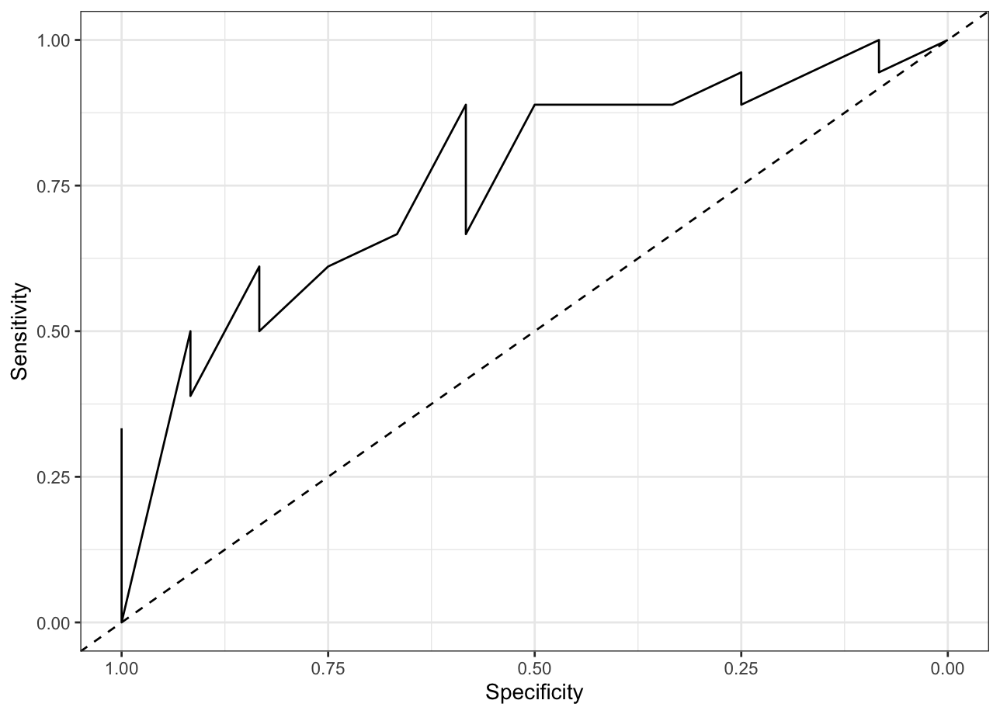
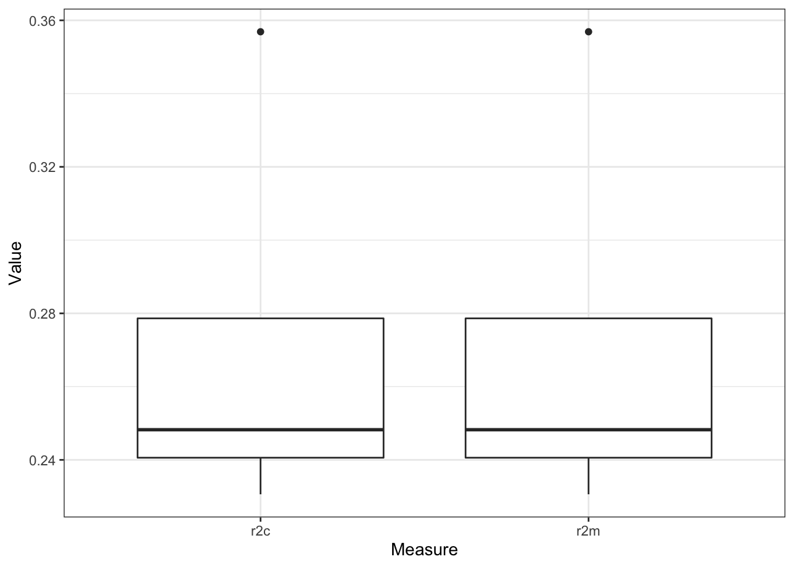
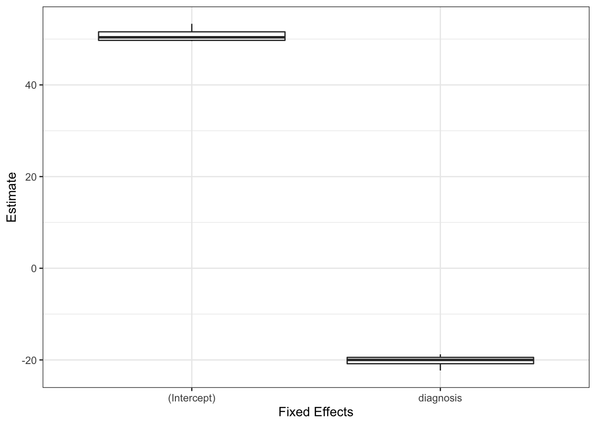

<!-- README.md is generated from README.Rmd. Please edit that file -->

# cvms <a href='https://github.com/LudvigOlsen/cvms'></a>

**Cross-Validation for Model Selection**  
**Authors:** [Ludvig R. Olsen](http://ludvigolsen.dk/) (
<r-pkgs@ludvigolsen.dk> ), Hugh Benjamin Zachariae <br/> **License:**
[MIT](https://opensource.org/licenses/MIT) <br/> **Started:** October
2016

[](https://cran.r-project.org/package=cvms)
[](https://cran.r-project.org/package=cvms)
[](https://cran.r-project.org/)
[](https://codecov.io/gh/ludvigolsen/cvms?branch=master)
[](https://travis-ci.org/LudvigOlsen/cvms)
[](https://ci.appveyor.com/project/LudvigOlsen/cvms)
[](https://zenodo.org/badge/latestdoi/71063931)

## Overview

R package: Cross-validate one or multiple regression or classification
models and get relevant evaluation metrics in a tidy format. Validate
the best model on a test set and compare it to a baseline evaluation.
Perform hyperparameter tuning with (sampled) grid search. Evaluate
predictions from an external model. Currently supports regression
(`'gaussian'`), binary classification (`'binomial'`), and (some
functions only) multiclass classification (`'multinomial'`).

Main functions:

  - `cross_validate()`  
  - `cross_validate_fn()`  
  - `validate()`  
  - `validate_fn()`  
  - `evaluate()`
  - `baseline()`  
  - `combine_predictors()`  
  - `cv_plot()`  
  - `select_metrics()`  
  - `reconstruct_formulas()`

## Table of Contents

  - [cvms](#cvms)
      - [Overview](#overview)
          - [The difference between `cross_validate()` and
            `cross_validate_fn()`](#diff-cv-fn)
      - [Important News](#news)
      - [Installation](#installation)
  - [Examples](#examples)
      - [Attach packages](#packages)
      - [Load data](#load-data)
      - [Fold data](#fold)
      - [Cross-validate a single model](#cv-single)
          - [Gaussian](#cv-single-gaussian)
          - [Binomial](#cv-single-binomial)
      - [Cross-validate multiple models](#cv-multi)
          - [Create model formulas](#cv-multi-formulas)
          - [Cross-validate fixed effects models](#cv-multi-fixed)
          - [Cross-validate mixed effects models](#cv-multi-mixed)
      - [Repeated cross-validation](#cv-repeated)
      - [Cross-validating custom model functions](#cv-custom)
          - [SVM](#cv-custom-svm)
          - [Naive Bayes](#cv-custom-naive)
      - [Evaluating predictions](#evaluate)
          - [Multinomial](#evaluate-multinomial)
      - [Baseline evaluations](#baseline)
          - [Gaussian](#baseline-gaussian)
          - [Binomial](#baseline-binomial)
          - [Multinomial](#baseline-multinomial)
      - [Plot results](#plot)
          - [Gaussian](#plot-gaussian)
      - [Generate model formulas](#generate-formulas)

### The difference between `cross_validate()` and `cross_validate_fn()`

Originally, `cvms` only provided the option to cross-validate Gaussian
and binomial regression models, fitting the models internally with the
`lm()`, `lmer()`, `glm()`, and `glmer()` functions. The
`cross_validate()` function has thus been designed specifically to work
with those functions.

To allow cross-validation of custom model functions like support-vector
machines, neural networks, etc., the `cross_validate_fn()` function has
been added. You provide a model function and a predict function, and it
does the rest (see examples below). Additionally, you can provide a
preprocess function and a list or data frame with hyperparameter values
to test.

## Important News

Note: Check NEWS.md for the full list of changes.

  - In `cross_validate()` and `validate()`, the `models` argument is
    renamed to `formulas` and the `model_verbose` argument is renamed to
    `verbose`. Further, the `link` argument is hard-deprecated and will
    throw an error if used.

  - `Multinomial` AUC is now calculated with `pROC::multiclass.roc`.

  - `cross_validate_fn()` and `validate_fn()` now take the
    `preprocess_fn`, `preprocess_once`, and `hyperparameters` arguments.
    The `predict_type` argument has been removed.

  - `cross_validate_fn()` and `validate_fn()` are added.
    (Cross-)validate custom model functions.

  - In `evaluate()`, when `type` is `multinomial`, the output is now a
    single tibble. The `Class Level Results` are included as a nested
    tibble.

  - Adds `'multinomial'` family to `baseline()` and `evaluate()`.

  - `evaluate()` is added. Evaluate your model’s predictions with the
    same metrics as used in `cross_validate()`.

  - `Binomial` AUC calculation has changed. Now explicitly sets the
    direction in `pROC::roc`. (27th of May 2019)

  - Argument `positive` now defaults to `2`. If a dependent variable has
    the values 0 and 1, 1 is now the default positive class, as that’s
    the second smallest value. If the dependent variable is of type
    `character`, it’s in alphabetical order.

## Installation

CRAN:

> install.packages(“cvms”)

Development version:

> install.packages(“devtools”)
> 
> devtools::install\_github(“LudvigOlsen/groupdata2”)
> 
> devtools::install\_github(“LudvigOlsen/cvms”)

# Examples

## Attach packages

``` r
library(cvms)
library(groupdata2) # fold() partition()
library(knitr) # kable()
library(dplyr) # %>% arrange()
library(ggplot2)
```

## Load data

The dataset `participant.scores` comes with cvms.

``` r
data <- participant.scores
```

## Fold data

Create a grouping factor for subsetting of folds using
`groupdata2::fold()`. Order the dataset by the folds.

``` r
# Set seed for reproducibility
set.seed(7)

# Fold data 
data <- fold(data, k = 4,
             cat_col = 'diagnosis',
             id_col = 'participant') %>% 
  arrange(.folds)

# Show first 15 rows of data
data %>% head(15) %>% kable()
```

| participant | age | diagnosis | score | session | .folds |
| :---------- | --: | --------: | ----: | ------: | :----- |
| 9           |  34 |         0 |    33 |       1 | 1      |
| 9           |  34 |         0 |    53 |       2 | 1      |
| 9           |  34 |         0 |    66 |       3 | 1      |
| 8           |  21 |         1 |    16 |       1 | 1      |
| 8           |  21 |         1 |    32 |       2 | 1      |
| 8           |  21 |         1 |    44 |       3 | 1      |
| 2           |  23 |         0 |    24 |       1 | 2      |
| 2           |  23 |         0 |    40 |       2 | 2      |
| 2           |  23 |         0 |    67 |       3 | 2      |
| 1           |  20 |         1 |    10 |       1 | 2      |
| 1           |  20 |         1 |    24 |       2 | 2      |
| 1           |  20 |         1 |    45 |       3 | 2      |
| 6           |  31 |         1 |    14 |       1 | 2      |
| 6           |  31 |         1 |    25 |       2 | 2      |
| 6           |  31 |         1 |    30 |       3 | 2      |

## Cross-validate a single model

### Gaussian

``` r
CV1 <- cross_validate(data, 
                      formulas = "score~diagnosis",
                      fold_cols = '.folds',
                      family = 'gaussian',
                      REML = FALSE)

# Show results
CV1
#> # A tibble: 1 x 21
#>    RMSE   MAE NRMSE RMSEIQR   r2m   r2c   AIC  AICc   BIC Predictions Results
#>   <dbl> <dbl> <dbl>   <dbl> <dbl> <dbl> <dbl> <dbl> <dbl> <list>      <list> 
#> 1  16.4  13.8 0.272   0.937 0.271 0.271  195.  196.  198. <tibble [3… <tibbl…
#> # … with 10 more variables: Coefficients <list>, Folds <int>, `Fold
#> #   Columns` <int>, `Convergence Warnings` <int>, `Singular Fit
#> #   Messages` <int>, `Other Warnings` <int>, `Warnings and Messages` <list>,
#> #   Family <chr>, Dependent <chr>, Fixed <chr>

# Let's take a closer look at the different parts of the output 

# Results metrics
CV1 %>% select_metrics() %>% kable()
```

|     RMSE |      MAE |   NRMSE |   RMSEIQR |      r2m |      r2c |      AIC |     AICc |      BIC | Dependent | Fixed     |
| -------: | -------: | ------: | --------: | -------: | -------: | -------: | -------: | -------: | :-------- | :-------- |
| 16.35261 | 13.75772 | 0.27203 | 0.9373575 | 0.270991 | 0.270991 | 194.6218 | 195.9276 | 197.9556 | score     | diagnosis |

``` r

# Nested predictions 
# Note that [[1]] picks predictions for the first row
CV1$Predictions[[1]] %>% head() %>% kable()
```

| Fold Column | Fold | Observation | Target | Prediction |
| :---------- | ---: | ----------: | -----: | ---------: |
| .folds      |    1 |           1 |     33 |   51.00000 |
| .folds      |    1 |           2 |     53 |   51.00000 |
| .folds      |    1 |           3 |     66 |   51.00000 |
| .folds      |    1 |           4 |     16 |   30.66667 |
| .folds      |    1 |           5 |     32 |   30.66667 |
| .folds      |    1 |           6 |     44 |   30.66667 |

``` r

# Nested results from the different folds
CV1$Results[[1]] %>% kable()
```

| Fold Column | Fold |      MAE |     RMSE |     NRMSE |   RMSEIQR |       r2m |       r2c |      AIC |     AICc |      BIC |
| :---------- | ---: | -------: | -------: | --------: | --------: | --------: | --------: | -------: | -------: | -------: |
| .folds      |    1 | 10.72222 | 12.56760 | 0.2513519 | 0.6793295 | 0.2439198 | 0.2439198 | 209.9622 | 211.1622 | 213.4963 |
| .folds      |    2 | 14.77778 | 16.60767 | 0.2913627 | 1.0379796 | 0.2525524 | 0.2525524 | 182.8739 | 184.2857 | 186.0075 |
| .folds      |    3 | 12.87037 | 15.97355 | 0.2384112 | 1.2528275 | 0.2306104 | 0.2306104 | 207.9074 | 209.1074 | 211.4416 |
| .folds      |    4 | 16.66049 | 20.26162 | 0.3069943 | 0.7792933 | 0.3568816 | 0.3568816 | 177.7436 | 179.1554 | 180.8772 |

``` r

# Nested model coefficients
# Note that you have the full p-values, 
# but kable() only shows a certain number of digits
CV1$Coefficients[[1]] %>% kable()
```

| Fold Column | Fold | term        |   estimate | std.error |  statistic |   p.value |
| :---------- | ---: | :---------- | ---------: | --------: | ---------: | --------: |
| .folds      |    1 | (Intercept) |   51.00000 |  5.901264 |   8.642216 | 0.0000000 |
| .folds      |    1 | diagnosis   | \-20.33333 |  7.464574 | \-2.723978 | 0.0123925 |
| .folds      |    2 | (Intercept) |   53.33333 |  5.718886 |   9.325826 | 0.0000000 |
| .folds      |    2 | diagnosis   | \-19.66667 |  7.565375 | \-2.599563 | 0.0176016 |
| .folds      |    3 | (Intercept) |   49.77778 |  5.653977 |   8.804030 | 0.0000000 |
| .folds      |    3 | diagnosis   | \-18.77778 |  7.151778 | \-2.625610 | 0.0154426 |
| .folds      |    4 | (Intercept) |   49.55556 |  5.061304 |   9.791065 | 0.0000000 |
| .folds      |    4 | diagnosis   | \-22.30556 |  6.695476 | \-3.331437 | 0.0035077 |

``` r

# Additional information about the model
# and the training process
CV1 %>% select(13:21) %>% kable()
```

| Folds | Fold Columns | Convergence Warnings | Singular Fit Messages | Other Warnings | Warnings and Messages                                                                                                       | Family   | Dependent | Fixed     |
| ----: | -----------: | -------------------: | --------------------: | -------------: | :-------------------------------------------------------------------------------------------------------------------------- | :------- | :-------- | :-------- |
|     4 |            1 |                    0 |                     0 |              0 | list(`Fold Column` = character(0), Fold = integer(0), Function = character(0), Type = character(0), Message = character(0)) | gaussian | score     | diagnosis |

### Binomial

``` r
CV2 <- cross_validate(data, 
                      formulas = "diagnosis~score",
                      fold_cols = '.folds',
                      family = 'binomial')

# Show results
CV2
#> # A tibble: 1 x 28
#>   `Balanced Accur…    F1 Sensitivity Specificity `Pos Pred Value`
#>              <dbl> <dbl>       <dbl>       <dbl>            <dbl>
#> 1            0.736 0.821       0.889       0.583            0.762
#> # … with 23 more variables: `Neg Pred Value` <dbl>, AUC <dbl>, `Lower
#> #   CI` <dbl>, `Upper CI` <dbl>, Kappa <dbl>, MCC <dbl>, `Detection
#> #   Rate` <dbl>, `Detection Prevalence` <dbl>, Prevalence <dbl>,
#> #   Predictions <list>, ROC <list>, `Confusion Matrix` <list>, Results <list>,
#> #   Coefficients <list>, Folds <int>, `Fold Columns` <int>, `Convergence
#> #   Warnings` <int>, `Singular Fit Messages` <int>, `Other Warnings` <int>,
#> #   `Warnings and Messages` <list>, Family <chr>, Dependent <chr>, Fixed <chr>

# Let's take a closer look at the different parts of the output 
# We won't repeat the parts too similar to those in Gaussian

# Results metrics
CV2 %>% select(1:9) %>% kable()
```

| Balanced Accuracy |        F1 | Sensitivity | Specificity | Pos Pred Value | Neg Pred Value |       AUC |  Lower CI |  Upper CI |
| ----------------: | --------: | ----------: | ----------: | -------------: | -------------: | --------: | --------: | --------: |
|         0.7361111 | 0.8205128 |   0.8888889 |   0.5833333 |      0.7619048 |      0.7777778 | 0.7685185 | 0.5962701 | 0.9407669 |

``` r
CV2 %>% select(10:14) %>% kable()
```

|     Kappa |       MCC | Detection Rate | Detection Prevalence | Prevalence |
| --------: | --------: | -------------: | -------------------: | ---------: |
| 0.4927536 | 0.5048268 |      0.5333333 |                  0.7 |        0.6 |

``` r

# Confusion matrix
CV2$`Confusion Matrix`[[1]] %>% kable()
```

| Fold Column | Prediction | Target | Pos\_0 | Pos\_1 |  N |
| :---------- | :--------- | :----- | :----- | :----- | -: |
| .folds      | 0          | 0      | TP     | TN     |  7 |
| .folds      | 1          | 0      | FN     | FP     |  5 |
| .folds      | 0          | 1      | FP     | FN     |  2 |
| .folds      | 1          | 1      | TN     | TP     | 16 |

## Cross-validate multiple models

### Create model formulas

``` r
model_formulas <- c("score~diagnosis", "score~age")
mixed_model_formulas <- c("score~diagnosis+(1|session)", "score~age+(1|session)")
```

### Cross-validate fixed effects models

``` r
CV3 <- cross_validate(data, 
                      formulas = model_formulas,
                      fold_cols = '.folds',
                      family = 'gaussian',
                      REML = FALSE)

# Show results
CV3
#> # A tibble: 2 x 21
#>    RMSE   MAE NRMSE RMSEIQR    r2m    r2c   AIC  AICc   BIC Predictions Results
#>   <dbl> <dbl> <dbl>   <dbl>  <dbl>  <dbl> <dbl> <dbl> <dbl> <list>      <list> 
#> 1  16.4  13.8 0.272   0.937 0.271  0.271   195.  196.  198. <tibble [3… <tibbl…
#> 2  22.4  18.9 0.371   1.35  0.0338 0.0338  201.  202.  204. <tibble [3… <tibbl…
#> # … with 10 more variables: Coefficients <list>, Folds <int>, `Fold
#> #   Columns` <int>, `Convergence Warnings` <int>, `Singular Fit
#> #   Messages` <int>, `Other Warnings` <int>, `Warnings and Messages` <list>,
#> #   Family <chr>, Dependent <chr>, Fixed <chr>
```

### Cross-validate mixed effects models

``` r
CV4 <- cross_validate(data, 
                      formulas = mixed_model_formulas,
                      fold_cols = '.folds',
                      family = 'gaussian',
                      REML = FALSE)

# Show results
CV4
#> # A tibble: 2 x 22
#>    RMSE   MAE NRMSE RMSEIQR    r2m   r2c   AIC  AICc   BIC Predictions Results
#>   <dbl> <dbl> <dbl>   <dbl>  <dbl> <dbl> <dbl> <dbl> <dbl> <list>      <list> 
#> 1  7.95  6.41 0.129   0.438 0.290  0.811  176.  178.  180. <tibble [3… <tibbl…
#> 2 17.5  16.2  0.288   1.08  0.0366 0.526  194.  196.  198. <tibble [3… <tibbl…
#> # … with 11 more variables: Coefficients <list>, Folds <int>, `Fold
#> #   Columns` <int>, `Convergence Warnings` <int>, `Singular Fit
#> #   Messages` <int>, `Other Warnings` <int>, `Warnings and Messages` <list>,
#> #   Family <chr>, Dependent <chr>, Fixed <chr>, Random <chr>
```

## Repeated cross-validation

Let’s first add some extra fold columns. We will use the num\_fold\_cols
argument to add 3 unique fold columns. We tell `fold()` to keep the
existing fold column and simply add three extra columns. We could also
choose to remove the existing fold column, if for instance we were
changing the number of folds (k). Note, that the original fold column
will be renamed to “.folds\_1”.

``` r
# Set seed for reproducibility
set.seed(2)

# Fold data 
data <- fold(data, k = 4,
             cat_col = 'diagnosis',
             id_col = 'participant',
             num_fold_cols = 3,
             handle_existing_fold_cols = "keep")

# Show first 15 rows of data
data %>% head(10) %>% kable()
```

| participant | age | diagnosis | score | session | .folds\_1 | .folds\_2 | .folds\_3 | .folds\_4 |
| :---------- | --: | --------: | ----: | ------: | :-------- | :-------- | :-------- | :-------- |
| 10          |  32 |         0 |    29 |       1 | 4         | 4         | 3         | 1         |
| 10          |  32 |         0 |    55 |       2 | 4         | 4         | 3         | 1         |
| 10          |  32 |         0 |    81 |       3 | 4         | 4         | 3         | 1         |
| 2           |  23 |         0 |    24 |       1 | 2         | 3         | 1         | 2         |
| 2           |  23 |         0 |    40 |       2 | 2         | 3         | 1         | 2         |
| 2           |  23 |         0 |    67 |       3 | 2         | 3         | 1         | 2         |
| 4           |  21 |         0 |    35 |       1 | 3         | 2         | 4         | 4         |
| 4           |  21 |         0 |    50 |       2 | 3         | 2         | 4         | 4         |
| 4           |  21 |         0 |    78 |       3 | 3         | 2         | 4         | 4         |
| 9           |  34 |         0 |    33 |       1 | 1         | 1         | 2         | 3         |

``` r
CV5 <- cross_validate(data, 
                      formulas = "diagnosis ~ score",
                      fold_cols = paste0(".folds_", 1:4),
                      family = 'binomial',
                      REML = FALSE)

# Show results
CV5
#> # A tibble: 1 x 28
#>   `Balanced Accur…    F1 Sensitivity Specificity `Pos Pred Value`
#>              <dbl> <dbl>       <dbl>       <dbl>            <dbl>
#> 1            0.729 0.813       0.875       0.583            0.759
#> # … with 23 more variables: `Neg Pred Value` <dbl>, AUC <dbl>, `Lower
#> #   CI` <dbl>, `Upper CI` <dbl>, Kappa <dbl>, MCC <dbl>, `Detection
#> #   Rate` <dbl>, `Detection Prevalence` <dbl>, Prevalence <dbl>,
#> #   Predictions <list>, ROC <list>, `Confusion Matrix` <list>, Results <list>,
#> #   Coefficients <list>, Folds <int>, `Fold Columns` <int>, `Convergence
#> #   Warnings` <int>, `Singular Fit Messages` <int>, `Other Warnings` <int>,
#> #   `Warnings and Messages` <list>, Family <chr>, Dependent <chr>, Fixed <chr>

# The binomial output now has a nested 'Results' tibble
# Let's see a subset of the columns
CV5$Results[[1]] %>% select(1:8) %>%  kable()
```

| Fold Column | Balanced Accuracy |        F1 | Sensitivity | Specificity | Pos Pred Value | Neg Pred Value |       AUC |
| :---------- | ----------------: | --------: | ----------: | ----------: | -------------: | -------------: | --------: |
| .folds\_1   |         0.7361111 | 0.8205128 |   0.8888889 |   0.5833333 |      0.7619048 |      0.7777778 | 0.7685185 |
| .folds\_2   |         0.7361111 | 0.8205128 |   0.8888889 |   0.5833333 |      0.7619048 |      0.7777778 | 0.7777778 |
| .folds\_3   |         0.7083333 | 0.7894737 |   0.8333333 |   0.5833333 |      0.7500000 |      0.7000000 | 0.7476852 |
| .folds\_4   |         0.7361111 | 0.8205128 |   0.8888889 |   0.5833333 |      0.7619048 |      0.7777778 | 0.7662037 |

## Cross-validating custom model functions

`cross_validate_fn()` works with regression (`gaussian`), binary
classification (`binomial`), and multiclass classification
(`multinomial`).

### SVM

Let’s cross-validate a support-vector machine using the `svm()` function
from the `e1071` package. First, we will create a model function. You
can do anything you want in it, as long as it takes the arguments
`train_data` and `formula` and returns the fitted model object.

``` r
# Create model function
#
# train_data : tibble with the training data
# formula : a formula object
# hyperparameters : a named list of hyparameters

svm_model_fn <- function(train_data, formula, hyperparameters){
  
  # Note that `formula` must be specified first
  # when calling svm(), otherwise it fails
  e1071::svm(formula = formula,
             data = train_data, 
             kernel = "linear",
             type = "C-classification",
             probability = TRUE)
}
```

``` r
# Create predict function
#
# test_data : tibble with the test data
# model : fitted model object
# formula : a formula object
# hyperparameters : a named list of hyparameters

svm_predict_fn <- function(test_data, model, formula, hyperparameters){
  predictions <- stats::predict(object = model,
                 newdata = test_data,
                 allow.new.levels = TRUE,
                 probability = TRUE)

  # Extract probabilities
  probabilities <- dplyr::as_tibble(
    attr(predictions, "probabilities")
    )

  # Return second column
  probabilities[[2]]
}
```

<!-- For the `svm()` function, the default predict function and settings within `cross_validate_fn()` works, so we don't have to specify a predict function. In many cases, it's probably safer to supply a predict function anyway, so you're sure everything is correct. We will see how in the naive Bayes example below, but first, let's cross-validate the model function. Note, that some of the arguments have changed names (`models -> formulas`, `family -> type`). -->

``` r
# Cross-validate svm_model_fn
CV6 <- cross_validate_fn(data = data,
                         model_fn = svm_model_fn,
                         predict_fn = svm_predict_fn,
                         formulas = c("diagnosis~score", "diagnosis~age"),
                         fold_cols = '.folds_1', 
                         type = 'binomial')
#> Will cross-validate 2 models. This requires fitting 8 model instances.

CV6
#> # A tibble: 2 x 27
#>   `Balanced Accur…    F1 Sensitivity Specificity `Pos Pred Value`
#>              <dbl> <dbl>       <dbl>       <dbl>            <dbl>
#> 1            0.653 0.780       0.889       0.417            0.696
#> 2            0.458 0.615       0.667       0.25             0.571
#> # … with 22 more variables: `Neg Pred Value` <dbl>, AUC <dbl>, `Lower
#> #   CI` <dbl>, `Upper CI` <dbl>, Kappa <dbl>, MCC <dbl>, `Detection
#> #   Rate` <dbl>, `Detection Prevalence` <dbl>, Prevalence <dbl>,
#> #   Predictions <list>, ROC <list>, `Confusion Matrix` <list>, Results <list>,
#> #   Coefficients <list>, Folds <int>, `Fold Columns` <int>, `Convergence
#> #   Warnings` <int>, `Other Warnings` <int>, `Warnings and Messages` <list>,
#> #   Family <chr>, Dependent <chr>, Fixed <chr>
```

### Naive Bayes

The naive Bayes classifier requires us to supply a predict function, so
we will go through that next. First, let’s create the model function.

``` r
# Create model function
#
# train_data : tibble with the training data
# formula : a formula object

nb_model_fn <- function(train_data, formula, hyperparameters){
  e1071::naiveBayes(formula = formula, 
                    data = train_data)
}
```

Now, we will create a predict function. This will usually wrap
`stats::predict()` and just make sure, the predictions have the correct
format. When `type` is `binomial`, the predictions should be a vector,
or a one-column matrix / data frame, with the probabilities of the
second class (alphabetically). That is, if we have the classes `0` and
`1`, it should be the probabilities of the observations being in class
`1`. The help file, `?cross_validate_fn`, describes the formats for the
other types (`gaussian` and `multinomial`).

The predict function should take the arguments `test_data`, `model`, and
`formula`. You do not need to use the `formula` within your function.

``` r
# Create predict function
#
# test_data : tibble with the test data
# model : fitted model object
# formula : a formula object
nb_predict_fn <- function(test_data, model, formula, hyperparameters){
  stats::predict(object = model, newdata = test_data, 
                 type = "raw", allow.new.levels = TRUE)[,2]
}
```

With both functions specified, we are ready to cross-validate our naive
Bayes classifier.

``` r
CV7 <- cross_validate_fn(data,
                         model_fn = nb_model_fn,
                         predict_fn = nb_predict_fn,
                         formulas = c("diagnosis~score", "diagnosis~age"),
                         type = 'binomial',
                         fold_cols = '.folds_1')
#> Will cross-validate 2 models. This requires fitting 8 model instances.

CV7
#> # A tibble: 2 x 27
#>   `Balanced Accur…    F1 Sensitivity Specificity `Pos Pred Value`
#>              <dbl> <dbl>       <dbl>       <dbl>            <dbl>
#> 1            0.736 0.821       0.889       0.583            0.762
#> 2            0.25  0.462       0.5         0                0.429
#> # … with 22 more variables: `Neg Pred Value` <dbl>, AUC <dbl>, `Lower
#> #   CI` <dbl>, `Upper CI` <dbl>, Kappa <dbl>, MCC <dbl>, `Detection
#> #   Rate` <dbl>, `Detection Prevalence` <dbl>, Prevalence <dbl>,
#> #   Predictions <list>, ROC <list>, `Confusion Matrix` <list>, Results <list>,
#> #   Coefficients <list>, Folds <int>, `Fold Columns` <int>, `Convergence
#> #   Warnings` <int>, `Other Warnings` <int>, `Warnings and Messages` <list>,
#> #   Family <chr>, Dependent <chr>, Fixed <chr>
```

## Evaluating predictions

Evaluate predictions from a model trained outside cvms. Works with
regression (`gaussian`), binary classification (`binomial`), and
multiclass classification (`multinomial`). The following is an example
of multinomial evaluation.

### Multinomial

Create a dataset with 3 predictors and a target column. Partition it
with `groupdata2::partition()` to create a training set and a validation
set. `multiclass_probability_tibble()` is a simple helper function for
generating random tibbles.

``` r
# Set seed
set.seed(1)

# Create class names
class_names <- paste0("class_", 1:4)

# Create random dataset with 100 observations 
# Partition into training set (75%) and test set (25%)
multiclass_partitions <- multiclass_probability_tibble(
  num_classes = 3, # Here, number of predictors
  num_observations = 100,
  apply_softmax = FALSE,
  FUN = rnorm,
  class_name = "predictor_") %>%
  dplyr::mutate(class = sample(
    class_names,
    size = 100,
    replace = TRUE)) %>%
  partition(p = 0.75,
            cat_col = "class")

# Extract partitions
multiclass_train_set <- multiclass_partitions[[1]]
multiclass_test_set <- multiclass_partitions[[2]]

multiclass_test_set
#> # A tibble: 26 x 4
#>    predictor_1 predictor_2 predictor_3 class  
#>          <dbl>       <dbl>       <dbl> <chr>  
#>  1      1.60         0.158     -0.331  class_1
#>  2     -1.99        -0.180     -0.341  class_1
#>  3      0.418       -0.324      0.263  class_1
#>  4      0.398        0.450      0.136  class_1
#>  5      0.0743       1.03      -1.32   class_1
#>  6      0.738        0.910      0.541  class_2
#>  7      0.576        0.384     -0.0134 class_2
#>  8     -0.305        1.68       0.510  class_2
#>  9     -0.0449      -0.393      1.52   class_2
#> 10      0.557       -0.464     -0.879  class_2
#> # … with 16 more rows
```

Train multinomial model using the `nnet` package and get the predicted
probabilities.

``` r
# Train multinomial model
multiclass_model <- nnet::multinom(
   "class ~ predictor_1 + predictor_2 + predictor_3",
   data = multiclass_train_set)
#> # weights:  20 (12 variable)
#> initial  value 102.585783 
#> iter  10 value 98.124010
#> final  value 98.114250 
#> converged

# Predict the targets in the test set
predictions <- predict(multiclass_model, 
                       multiclass_test_set,
                       type = "probs") %>%
  dplyr::as_tibble()

# Add the targets
predictions[["target"]] <- multiclass_test_set[["class"]]

head(predictions, 10)
#> # A tibble: 10 x 5
#>    class_1 class_2 class_3 class_4 target 
#>      <dbl>   <dbl>   <dbl>   <dbl> <chr>  
#>  1   0.243   0.214   0.304   0.239 class_1
#>  2   0.136   0.371   0.234   0.259 class_1
#>  3   0.230   0.276   0.264   0.230 class_1
#>  4   0.194   0.218   0.262   0.326 class_1
#>  5   0.144   0.215   0.302   0.339 class_1
#>  6   0.186   0.166   0.241   0.407 class_2
#>  7   0.201   0.222   0.272   0.305 class_2
#>  8   0.117   0.131   0.195   0.557 class_2
#>  9   0.237   0.264   0.215   0.284 class_2
#> 10   0.216   0.310   0.303   0.171 class_2
```

Perform the evaluation. This will create one-vs-all binomial evaluations
and summarize the results.

``` r
# Evaluate predictions
ev <- evaluate(data = predictions,
               target_col = "target",
               prediction_cols = class_names,
               type = "multinomial")

ev
#> # A tibble: 1 x 15
#>   `Overall Accura… `Balanced Accur…    F1 Sensitivity Specificity
#>              <dbl>            <dbl> <dbl>       <dbl>       <dbl>
#> 1            0.154            0.427   NaN       0.143       0.712
#> # … with 10 more variables: `Pos Pred Value` <dbl>, `Neg Pred Value` <dbl>,
#> #   Kappa <dbl>, MCC <dbl>, `Detection Rate` <dbl>, `Detection
#> #   Prevalence` <dbl>, Prevalence <dbl>, Predictions <list>, `Confusion
#> #   Matrix` <list>, `Class Level Results` <list>
```

The class level results (i.e., the one-vs-all evaluations) are also
included, and would usually be reported alongside the above results.

``` r
ev$`Class Level Results`
#> [[1]]
#> # A tibble: 4 x 14
#>   Class `Balanced Accur…      F1 Sensitivity Specificity `Pos Pred Value`
#>   <chr>            <dbl>   <dbl>       <dbl>       <dbl>            <dbl>
#> 1 clas…            0.476 NaN           0           0.952            0    
#> 2 clas…            0.380   0.211       0.286       0.474            0.167
#> 3 clas…            0.474 NaN           0           0.947            0    
#> 4 clas…            0.380   0.211       0.286       0.474            0.167
#> # … with 8 more variables: `Neg Pred Value` <dbl>, Kappa <dbl>, MCC <dbl>,
#> #   `Detection Rate` <dbl>, `Detection Prevalence` <dbl>, Prevalence <dbl>,
#> #   Support <int>, `Confusion Matrix` <list>
```

## Baseline evaluations

Create baseline evaluations of a test set.

### Gaussian

Approach: The baseline model (y ~ 1), where 1 is simply the intercept
(i.e. mean of y), is fitted on n random subsets of the training set and
evaluated on the test set. We also perform an evaluation of the model
fitted on the entire training set.

Start by partitioning the dataset.

``` r
# Set seed for reproducibility
set.seed(1)

# Partition the dataset 
partitions <- groupdata2::partition(participant.scores,
                                    p = 0.7,
                                    cat_col = 'diagnosis',
                                    id_col = 'participant',
                                    list_out = TRUE)
train_set <- partitions[[1]]
test_set <- partitions[[2]]
```

Create the baseline evaluations:

``` r
baseline(test_data = test_set, train_data = train_set,
         n = 100, dependent_col = "score", family = "gaussian")
#> $summarized_metrics
#> # A tibble: 9 x 6
#>   Measure   RMSE    MAE  NRMSE RMSEIQR `Training Rows`
#>   <chr>    <dbl>  <dbl>  <dbl>   <dbl>           <dbl>
#> 1 Mean     19.7  15.8   0.290   0.949             9.63
#> 2 Median   19.2  15.5   0.282   0.925             9   
#> 3 SD        1.05  0.759 0.0154  0.0504            3.22
#> 4 IQR       1.16  0.264 0.0171  0.0560            5   
#> 5 Max      24.1  19.4   0.355   1.16             15   
#> 6 Min      18.9  15.5   0.278   0.912             5   
#> 7 NAs       0     0     0       0                 0   
#> 8 INFs      0     0     0       0                 0   
#> 9 All_rows 19.1  15.5   0.282   0.923            18   
#> 
#> $random_evaluations
#> # A tibble: 100 x 10
#>     RMSE   MAE NRMSE RMSEIQR Predictions Coefficients `Training Rows` Family
#>    <dbl> <dbl> <dbl>   <dbl> <list>      <list>                 <int> <chr> 
#>  1  20.0  16.3 0.294   0.964 <tibble [1… <tibble [1 …               8 gauss…
#>  2  19.0  15.5 0.279   0.914 <tibble [1… <tibble [1 …              15 gauss…
#>  3  20.2  15.7 0.296   0.971 <tibble [1… <tibble [1 …               7 gauss…
#>  4  20.0  15.7 0.295   0.966 <tibble [1… <tibble [1 …              11 gauss…
#>  5  19.3  15.6 0.284   0.931 <tibble [1… <tibble [1 …               8 gauss…
#>  6  20.4  15.9 0.300   0.985 <tibble [1… <tibble [1 …               5 gauss…
#>  7  19.0  15.5 0.279   0.915 <tibble [1… <tibble [1 …              13 gauss…
#>  8  19.4  15.5 0.285   0.933 <tibble [1… <tibble [1 …              10 gauss…
#>  9  20.7  16.2 0.305   1.000 <tibble [1… <tibble [1 …               8 gauss…
#> 10  20.8  17.1 0.306   1.00  <tibble [1… <tibble [1 …               5 gauss…
#> # … with 90 more rows, and 2 more variables: Dependent <chr>, Fixed <chr>
```

### Binomial

Approach: n random sets of predictions are evaluated against the
dependent variable in the test set. We also evaluate a set of all 0s and
a set of all 1s.

Create the baseline evaluations:

``` r
baseline(test_data = test_set, n = 100, 
         dependent_col = "diagnosis", family = "binomial")
#> $summarized_metrics
#> # A tibble: 10 x 15
#>    Measure `Balanced Accur…      F1 Sensitivity Specificity `Pos Pred Value`
#>    <chr>              <dbl>   <dbl>       <dbl>       <dbl>            <dbl>
#>  1 Mean               0.502   0.495       0.478       0.525            0.498
#>  2 Median             0.5     0.5         0.5         0.5              0.5  
#>  3 SD                 0.147   0.159       0.215       0.210            0.194
#>  4 IQR                0.167   0.252       0.333       0.333            0.200
#>  5 Max                0.833   0.833       0.833       1                1    
#>  6 Min                0.167   0.182       0           0                0    
#>  7 NAs                0       4           0           0                0    
#>  8 INFs               0       0           0           0                0    
#>  9 All_0              0.5   NaN           0           1              NaN    
#> 10 All_1              0.5     0.667       1           0                0.5  
#> # … with 9 more variables: `Neg Pred Value` <dbl>, AUC <dbl>, `Lower CI` <dbl>,
#> #   `Upper CI` <dbl>, Kappa <dbl>, MCC <dbl>, `Detection Rate` <dbl>,
#> #   `Detection Prevalence` <dbl>, Prevalence <dbl>
#> 
#> $random_evaluations
#> # A tibble: 100 x 19
#>    `Balanced Accur…    F1 Sensitivity Specificity `Pos Pred Value`
#>               <dbl> <dbl>       <dbl>       <dbl>            <dbl>
#>  1            0.417 0.364       0.333       0.5              0.4  
#>  2            0.5   0.5         0.5         0.5              0.5  
#>  3            0.417 0.364       0.333       0.5              0.4  
#>  4            0.667 0.6         0.5         0.833            0.75 
#>  5            0.583 0.667       0.833       0.333            0.556
#>  6            0.667 0.6         0.5         0.833            0.75 
#>  7            0.25  0.308       0.333       0.167            0.286
#>  8            0.5   0.4         0.333       0.667            0.5  
#>  9            0.25  0.182       0.167       0.333            0.2  
#> 10            0.417 0.222       0.167       0.667            0.333
#> # … with 90 more rows, and 14 more variables: `Neg Pred Value` <dbl>,
#> #   AUC <dbl>, `Lower CI` <dbl>, `Upper CI` <dbl>, Kappa <dbl>, MCC <dbl>,
#> #   `Detection Rate` <dbl>, `Detection Prevalence` <dbl>, Prevalence <dbl>,
#> #   Predictions <list>, ROC <list>, `Confusion Matrix` <list>, Family <chr>,
#> #   Dependent <chr>
```

### Multinomial

Approach: Creates one-vs-all (binomial) baseline evaluations for n sets
of random predictions against the dependent variable, along with sets of
“all class x,y,z,…” predictions.

Create the baseline evaluations:

``` r
multiclass_baseline <- baseline(
  test_data = multiclass_test_set, n = 100,
  dependent_col = "class", family = "multinomial")

# Summarized metrics
multiclass_baseline$summarized_metrics
#> # A tibble: 12 x 13
#>    Measure `Overall Accura… `Balanced Accur…       F1 Sensitivity Specificity
#>    <chr>              <dbl>            <dbl>    <dbl>       <dbl>       <dbl>
#>  1 Mean              0.250            0.501    0.283       0.252       0.750 
#>  2 Median            0.231            0.494    0.280       0.243       0.746 
#>  3 SD                0.0841           0.0567   0.0737      0.0853      0.0284
#>  4 IQR               0.115            0.0795   0.0920      0.121       0.0385
#>  5 Max               0.538            0.786    0.667       1           1     
#>  6 Min               0.0769           0.262    0.111       0           0.474 
#>  7 NAs              NA                0       61           0           0     
#>  8 INFs             NA                0        0           0           0     
#>  9 All_cl…           0.192            0.5    NaN           0.25        0.75  
#> 10 All_cl…           0.269            0.5    NaN           0.25        0.75  
#> 11 All_cl…           0.269            0.5    NaN           0.25        0.75  
#> 12 All_cl…           0.269            0.5    NaN           0.25        0.75  
#> # … with 7 more variables: `Pos Pred Value` <dbl>, `Neg Pred Value` <dbl>,
#> #   Kappa <dbl>, MCC <dbl>, `Detection Rate` <dbl>, `Detection
#> #   Prevalence` <dbl>, Prevalence <dbl>

# Summarized class level results for class 1
multiclass_baseline$summarized_class_level_results %>% 
  dplyr::filter(Class == "class_1") %>%
  tidyr::unnest(Results)
#> # A tibble: 10 x 13
#>    Class Measure `Balanced Accur…      F1 Sensitivity Specificity
#>    <chr> <chr>              <dbl>   <dbl>       <dbl>       <dbl>
#>  1 clas… Mean               0.514   0.284       0.28       0.748 
#>  2 clas… Median             0.529   0.286       0.2        0.762 
#>  3 clas… SD                 0.102   0.106       0.191      0.0979
#>  4 clas… IQR                0.124   0.182       0.2        0.0952
#>  5 clas… Max                0.786   0.526       1          0.952 
#>  6 clas… Min                0.262   0.125       0          0.524 
#>  7 clas… NAs                0      18           0          0     
#>  8 clas… INFs               0       0           0          0     
#>  9 clas… All_0              0.5   NaN           0          1     
#> 10 clas… All_1              0.5     0.323       1          0     
#> # … with 7 more variables: `Pos Pred Value` <dbl>, `Neg Pred Value` <dbl>,
#> #   Kappa <dbl>, MCC <dbl>, `Detection Rate` <dbl>, `Detection
#> #   Prevalence` <dbl>, Prevalence <dbl>

# Random evaluations
# Note, that the class level results for each repetition
# is available as well
multiclass_baseline$random_evaluations
#> # A tibble: 100 x 18
#>    Repetition `Overall Accura… `Balanced Accur…      F1 Sensitivity Specificity
#>         <int>            <dbl>            <dbl>   <dbl>       <dbl>       <dbl>
#>  1          1            0.154            0.445 NaN           0.171       0.719
#>  2          2            0.269            0.518 NaN           0.279       0.758
#>  3          3            0.192            0.460   0.195       0.193       0.727
#>  4          4            0.385            0.591   0.380       0.386       0.797
#>  5          5            0.154            0.430 NaN           0.143       0.717
#>  6          6            0.154            0.438 NaN           0.157       0.718
#>  7          7            0.154            0.445 NaN           0.171       0.719
#>  8          8            0.346            0.574   0.341       0.364       0.784
#>  9          9            0.308            0.541   0.315       0.314       0.767
#> 10         10            0.308            0.536   0.322       0.3         0.772
#> # … with 90 more rows, and 12 more variables: `Pos Pred Value` <dbl>, `Neg Pred
#> #   Value` <dbl>, Kappa <dbl>, MCC <dbl>, `Detection Rate` <dbl>, `Detection
#> #   Prevalence` <dbl>, Prevalence <dbl>, Predictions <list>, `Confusion
#> #   Matrix` <list>, `Class Level Results` <list>, Family <chr>, Dependent <chr>
```

## Plot results

There are currently a small set of plots for quick visualization of the
results. It is supposed to be easy to extract the needed information to
create your own plots. If you lack access to any information or have
other requests or ideas, feel free to open an issue.

### Gaussian

``` r
cv_plot(CV1, type = "RMSE") +
  theme_bw()
```



``` r
cv_plot(CV1, type = "r2") +
  theme_bw()
```



``` r
cv_plot(CV1, type = "IC") +
  theme_bw()
```


``` r
cv_plot(CV1, type = "coefficients") +
  theme_bw()
```



## Generate model formulas

Instead of manually typing all possible model formulas for a set of
fixed effects (including the possible interactions),
`combine_predictors()` can do it for you (with some constraints).

When including interactions, \>200k formulas have been precomputed for
up to 8 fixed effects, with a maximum interaction size of 3, and a
maximum of 5 fixed effects per formula. It’s possible to further limit
the generated formulas.

We can also append a random effects structure to the generated formulas.

``` r
combine_predictors(dependent = "y",
                   fixed_effects = c("a","b","c"),
                   random_effects = "(1|d)")
#>  [1] "y ~ a + (1|d)"                     "y ~ b + (1|d)"                    
#>  [3] "y ~ c + (1|d)"                     "y ~ a * b + (1|d)"                
#>  [5] "y ~ a * c + (1|d)"                 "y ~ a + b + (1|d)"                
#>  [7] "y ~ a + c + (1|d)"                 "y ~ b * c + (1|d)"                
#>  [9] "y ~ b + c + (1|d)"                 "y ~ a * b * c + (1|d)"            
#> [11] "y ~ a * b + c + (1|d)"             "y ~ a * c + b + (1|d)"            
#> [13] "y ~ a + b * c + (1|d)"             "y ~ a + b + c + (1|d)"            
#> [15] "y ~ a * b + a * c + (1|d)"         "y ~ a * b + b * c + (1|d)"        
#> [17] "y ~ a * c + b * c + (1|d)"         "y ~ a * b + a * c + b * c + (1|d)"
```

If two or more fixed effects should not be in the same formula, like an
effect and its log-transformed version, we can provide them as sublists.

``` r
combine_predictors(dependent = "y",
                   fixed_effects = list("a", list("b","log_b")),
                   random_effects = "(1|d)")
#> [1] "y ~ a + (1|d)"         "y ~ b + (1|d)"         "y ~ log_b + (1|d)"    
#> [4] "y ~ a * b + (1|d)"     "y ~ a * log_b + (1|d)" "y ~ a + b + (1|d)"    
#> [7] "y ~ a + log_b + (1|d)"
```
