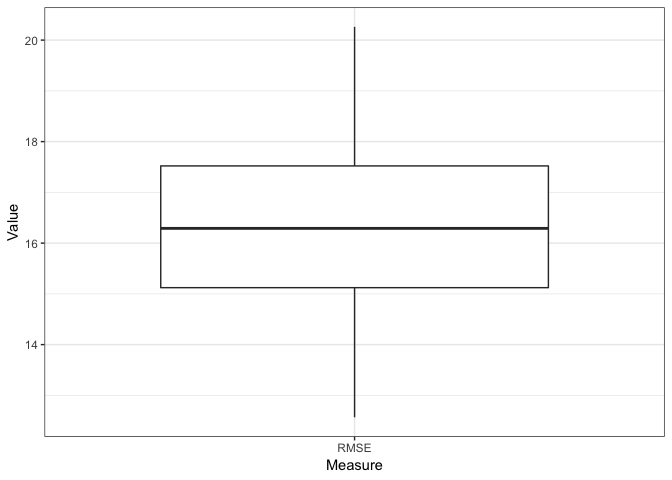
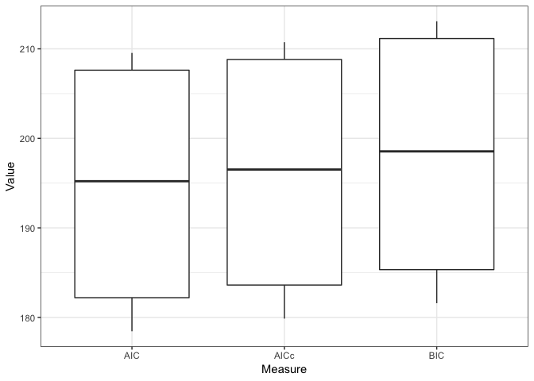
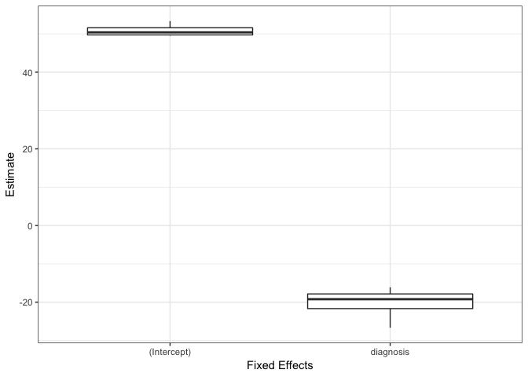

<!-- README.md is generated from README.Rmd. Please edit that file -->

# cvms

**Cross-Validation for Model Selection**

R package: Cross-validating gaussian and binomial regression models.

By Ludvig R. Olsen and Benjamin Zachariae,  
Cognitive Science, Aarhus University.  
Started in Oct. 2016

Contact at: <r-pkgs@ludvigolsen.dk>

Main functions:

  - cross\_validate()
  - validate()
  - combine\_predictors()
  - cv\_plot()
  - select\_metrics()
  - reconstruct\_metrics()

## Important News

  - AUC calculation has changed. Now explicitly sets the direction in
    pROC::roc.

  - Unit tests have been updated for the new random sampling generator
    in R 3.6.0. They will NOT run previous versions of R.

## Installation

Development version:

> install.packages(“devtools”)
> 
> devtools::install\_github(“LudvigOlsen/groupdata2”)
> 
> devtools::install\_github(“LudvigOlsen/cvms”)

# Examples

## Attach packages

``` r
library(cvms)
library(groupdata2) # fold()
library(knitr) # kable()
library(dplyr) # %>% arrange()
library(ggplot2)
```

## Load data

The dataset participant.scores comes with cvms.

``` r
data <- participant.scores
```

## Fold data

Create a grouping factor for subsetting in folds using
groupdata2::fold(). Order the dataset by the folds.

``` r
# Set seed for reproducibility
set.seed(7)

# Fold data 
data <- fold(data, k = 4,
             cat_col = 'diagnosis',
             id_col = 'participant') %>% 
  arrange(.folds)

# Show first 15 rows of data
data %>% head(15) %>% kable()
```

| participant | age | diagnosis | score | session | .folds |
| :---------- | --: | --------: | ----: | ------: | :----- |
| 9           |  34 |         0 |    33 |       1 | 1      |
| 9           |  34 |         0 |    53 |       2 | 1      |
| 9           |  34 |         0 |    66 |       3 | 1      |
| 8           |  21 |         1 |    16 |       1 | 1      |
| 8           |  21 |         1 |    32 |       2 | 1      |
| 8           |  21 |         1 |    44 |       3 | 1      |
| 2           |  23 |         0 |    24 |       1 | 2      |
| 2           |  23 |         0 |    40 |       2 | 2      |
| 2           |  23 |         0 |    67 |       3 | 2      |
| 1           |  20 |         1 |    10 |       1 | 2      |
| 1           |  20 |         1 |    24 |       2 | 2      |
| 1           |  20 |         1 |    45 |       3 | 2      |
| 6           |  31 |         1 |    14 |       1 | 2      |
| 6           |  31 |         1 |    25 |       2 | 2      |
| 6           |  31 |         1 |    30 |       3 | 2      |

## Cross-validate a single model

### Gaussian

``` r
CV1 <- cross_validate(data, "score~diagnosis", 
                     fold_cols = '.folds', 
                     family='gaussian', 
                     REML = FALSE)
#> Registered S3 method overwritten by 'xts':
#>   method     from
#>   as.zoo.xts zoo
#> Registered S3 method overwritten by 'MuMIn':
#>   method         from
#>   predict.merMod lme4

# Show results
CV1
#> # A tibble: 1 x 17
#>    RMSE   MAE   r2m   r2c   AIC  AICc   BIC Predictions Results
#>   <dbl> <dbl> <dbl> <dbl> <dbl> <dbl> <dbl> <list>      <list> 
#> 1  16.4  13.8 0.271 0.271  195.  196.  198. <tibble [3… <tibbl…
#> # … with 8 more variables: Coefficients <list>, Folds <int>, `Fold
#> #   Columns` <int>, `Convergence Warnings` <dbl>, Family <chr>,
#> #   Link <chr>, Dependent <chr>, Fixed <chr>

# Let's take a closer look at the different parts of the output 

# Results metrics
CV1 %>% select_metrics() %>% kable()
```

|     RMSE |      MAE |      r2m |      r2c |      AIC |     AICc |      BIC | Dependent | Fixed     |
| -------: | -------: | -------: | -------: | -------: | -------: | -------: | :-------- | :-------- |
| 16.35261 | 13.75772 | 0.270991 | 0.270991 | 194.6218 | 195.9276 | 197.9556 | score     | diagnosis |

``` r

# Nested predictions 
# Note that [[1]] picks predictions for the first row
CV1$Predictions[[1]] %>% head() %>% kable()
```

| Fold Column | Fold | Target | Prediction |
| :---------- | ---: | -----: | ---------: |
| .folds      |    1 |     33 |   51.00000 |
| .folds      |    1 |     53 |   51.00000 |
| .folds      |    1 |     66 |   51.00000 |
| .folds      |    1 |     16 |   30.66667 |
| .folds      |    1 |     32 |   30.66667 |
| .folds      |    1 |     44 |   30.66667 |

``` r

# Nested results from the different folds/models
CV1$Results[[1]] %>% kable()
```

| Fold Column | Fold |     RMSE |      MAE |       r2m |       r2c |      AIC |     AICc |      BIC |
| :---------- | ---: | -------: | -------: | --------: | --------: | -------: | -------: | -------: |
| .folds      |    1 | 12.56760 | 10.72222 | 0.2439198 | 0.2439198 | 209.9622 | 211.1622 | 213.4963 |
| .folds      |    2 | 16.60767 | 14.77778 | 0.2525524 | 0.2525524 | 182.8739 | 184.2857 | 186.0075 |
| .folds      |    3 | 15.97355 | 12.87037 | 0.2306104 | 0.2306104 | 207.9074 | 209.1074 | 211.4416 |
| .folds      |    4 | 20.26162 | 16.66049 | 0.3568816 | 0.3568816 | 177.7436 | 179.1554 | 180.8772 |

``` r

# Nested model coefficients
# Note that you have the full p-values, 
# but kable() only show a certain number of digits
CV1$Coefficients[[1]] %>% kable()
```

| term        |   estimate | std.error |  statistic | p.value | Fold | Fold Column |
| :---------- | ---------: | --------: | ---------: | ------: | ---: | :---------- |
| (Intercept) |   51.00000 |  5.901264 |   8.642216 |       0 |    1 | .folds      |
| diagnosis   | \-20.33333 |  7.464574 | \-2.723978 |       0 |    1 | .folds      |
| (Intercept) |   53.33333 |  5.718886 |   9.325826 |       0 |    2 | .folds      |
| diagnosis   | \-19.66667 |  7.565375 | \-2.599563 |       0 |    2 | .folds      |
| (Intercept) |   49.77778 |  5.653977 |   8.804030 |       0 |    3 | .folds      |
| diagnosis   | \-18.77778 |  7.151778 | \-2.625610 |       0 |    3 | .folds      |
| (Intercept) |   49.55556 |  5.061304 |   9.791065 |       0 |    4 | .folds      |
| diagnosis   | \-22.30556 |  6.695476 | \-3.331437 |       0 |    4 | .folds      |

``` r

# Additional information about the model
# and the training process
CV1 %>% select(11:17) %>% kable()
```

| Folds | Fold Columns | Convergence Warnings | Family   | Link     | Dependent | Fixed     |
| ----: | -----------: | -------------------: | :------- | :------- | :-------- | :-------- |
|     4 |            1 |                    0 | gaussian | identity | score     | diagnosis |

### Binomial

``` r
CV2 <- cross_validate(data, "diagnosis~score", 
                     fold_cols = '.folds', 
                     family='binomial')

# Show results
CV2
#> # A tibble: 1 x 25
#>   `Balanced Accur…    F1 Sensitivity Specificity `Pos Pred Value`
#>              <dbl> <dbl>       <dbl>       <dbl>            <dbl>
#> 1            0.736 0.667       0.583       0.889            0.778
#> # … with 20 more variables: `Neg Pred Value` <dbl>, AUC <dbl>, `Lower
#> #   CI` <dbl>, `Upper CI` <dbl>, Kappa <dbl>, MCC <dbl>, `Detection
#> #   Rate` <dbl>, `Detection Prevalence` <dbl>, Prevalence <dbl>,
#> #   Predictions <list>, ROC <list>, `Confusion Matrix` <list>,
#> #   Coefficients <list>, Folds <int>, `Fold Columns` <int>, `Convergence
#> #   Warnings` <dbl>, Family <chr>, Link <chr>, Dependent <chr>,
#> #   Fixed <chr>

# Let's take a closer look at the different parts of the output 
# We won't repeat the parts too similar to those in Gaussian

# Results metrics
CV2 %>% select(1:9) %>% kable()
```

| Balanced Accuracy |        F1 | Sensitivity | Specificity | Pos Pred Value | Neg Pred Value |       AUC |  Lower CI |  Upper CI |
| ----------------: | --------: | ----------: | ----------: | -------------: | -------------: | --------: | --------: | --------: |
|         0.7361111 | 0.6666667 |   0.5833333 |   0.8888889 |      0.7777778 |      0.7619048 | 0.7685185 | 0.5962701 | 0.9407669 |

``` r
CV2 %>% select(10:14) %>% kable()
```

|     Kappa |       MCC | Detection Rate | Detection Prevalence | Prevalence |
| --------: | --------: | -------------: | -------------------: | ---------: |
| 0.4927536 | 0.5048268 |      0.2333333 |                  0.3 |        0.4 |

``` r

# ROC curve info
CV2$ROC[[1]] %>% head() %>% kable()
```

| Sensitivities | Specificities |
| ------------: | ------------: |
|     1.0000000 |     0.0000000 |
|     1.0000000 |     0.0833333 |
|     0.9444444 |     0.0833333 |
|     0.9444444 |     0.1666667 |
|     0.9444444 |     0.2500000 |
|     0.8888889 |     0.2500000 |

``` r

# Confusion matrix
CV2$`Confusion Matrix`[[1]] %>% kable()
```

| Fold Column | Prediction | Reference | Pos\_0 | Pos\_1 |  N |
| :---------- | :--------- | :-------- | :----- | :----- | -: |
| .folds      | 0          | 0         | TP     | TN     |  7 |
| .folds      | 1          | 0         | FN     | FP     |  5 |
| .folds      | 0          | 1         | FP     | FN     |  2 |
| .folds      | 1          | 1         | TN     | TP     | 16 |

## Cross-validate multiple models

### Create model formulas

``` r
models <- c("score~diagnosis","score~age")
mixed_models <- c("score~diagnosis+(1|session)","score~age+(1|session)")
```

### Cross-validate fixed effects models

``` r
CV3 <- cross_validate(data, models, 
                     fold_cols = '.folds', 
                     family='gaussian', 
                     REML = FALSE)

# Show results
CV3
#> # A tibble: 2 x 17
#>    RMSE   MAE    r2m    r2c   AIC  AICc   BIC Predictions Results
#>   <dbl> <dbl>  <dbl>  <dbl> <dbl> <dbl> <dbl> <list>      <list> 
#> 1  16.4  13.8 0.271  0.271   195.  196.  198. <tibble [3… <tibbl…
#> 2  22.4  18.9 0.0338 0.0338  201.  202.  204. <tibble [3… <tibbl…
#> # … with 8 more variables: Coefficients <list>, Folds <int>, `Fold
#> #   Columns` <int>, `Convergence Warnings` <dbl>, Family <chr>,
#> #   Link <chr>, Dependent <chr>, Fixed <chr>
```

### Cross-validate mixed effects models

``` r
CV4 <- cross_validate(data, mixed_models, 
                     fold_cols = '.folds', 
                     family='gaussian', 
                     REML = FALSE)

# Show results
CV4
#> # A tibble: 2 x 18
#>    RMSE   MAE    r2m   r2c   AIC  AICc   BIC Predictions Results
#>   <dbl> <dbl>  <dbl> <dbl> <dbl> <dbl> <dbl> <list>      <list> 
#> 1  7.95  6.41 0.290  0.811  176.  178.  180. <tibble [3… <tibbl…
#> 2 17.5  16.2  0.0366 0.526  194.  196.  198. <tibble [3… <tibbl…
#> # … with 9 more variables: Coefficients <list>, Folds <int>, `Fold
#> #   Columns` <int>, `Convergence Warnings` <dbl>, Family <chr>,
#> #   Link <chr>, Dependent <chr>, Fixed <chr>, Random <chr>
```

## Repeated cross-validation

Note: currently only work with the github version of groupdata2\!

Let’s first create new folds. We will use the num\_fold\_cols argument
to add 3 unique fold columns.

``` r
# devtools::install_github("ludvigolsen/groupdata2")

# Set seed for reproducibility
set.seed(2)

# Fold data 
data <- fold(data, k = 4,
             cat_col = 'diagnosis',
             id_col = 'participant',
             num_fold_cols = 3)

# Show first 15 rows of data
data %>% head(10) %>% kable()
```

| participant | age | diagnosis | score | session | .folds\_1 | .folds\_2 | .folds\_3 |
| :---------- | --: | --------: | ----: | ------: | :-------- | :-------- | :-------- |
| 10          |  32 |         0 |    29 |       1 | 4         | 4         | 3         |
| 10          |  32 |         0 |    55 |       2 | 4         | 4         | 3         |
| 10          |  32 |         0 |    81 |       3 | 4         | 4         | 3         |
| 2           |  23 |         0 |    24 |       1 | 2         | 3         | 1         |
| 2           |  23 |         0 |    40 |       2 | 2         | 3         | 1         |
| 2           |  23 |         0 |    67 |       3 | 2         | 3         | 1         |
| 4           |  21 |         0 |    35 |       1 | 3         | 2         | 4         |
| 4           |  21 |         0 |    50 |       2 | 3         | 2         | 4         |
| 4           |  21 |         0 |    78 |       3 | 3         | 2         | 4         |
| 9           |  34 |         0 |    33 |       1 | 1         | 1         | 2         |

``` r
CV5 <- cross_validate(data, "diagnosis~score", 
                     fold_cols = c('.folds_1','.folds_2','.folds_3'), 
                     family='binomial', 
                     REML = FALSE)

# Show results
CV5
#> # A tibble: 1 x 26
#>   `Balanced Accur…    F1 Sensitivity Specificity `Pos Pred Value`
#>              <dbl> <dbl>       <dbl>       <dbl>            <dbl>
#> 1            0.727 0.657       0.583       0.870            0.752
#> # … with 21 more variables: `Neg Pred Value` <dbl>, AUC <dbl>, `Lower
#> #   CI` <dbl>, `Upper CI` <dbl>, Kappa <dbl>, MCC <dbl>, `Detection
#> #   Rate` <dbl>, `Detection Prevalence` <dbl>, Prevalence <dbl>,
#> #   Predictions <list>, ROC <list>, `Confusion Matrix` <list>,
#> #   Coefficients <list>, Results <list>, Folds <int>, `Fold
#> #   Columns` <int>, `Convergence Warnings` <dbl>, Family <chr>,
#> #   Link <chr>, Dependent <chr>, Fixed <chr>

# The binomial output now has a nested results tibble
# Let's see a subset of the columns
CV5$Results[[1]] %>% select(1:8) %>%  kable()
```

| Fold Column | Balanced Accuracy |        F1 | Sensitivity | Specificity | Pos Pred Value | Neg Pred Value |       AUC |
| :---------- | ----------------: | --------: | ----------: | ----------: | -------------: | -------------: | --------: |
| .folds\_1   |         0.7361111 | 0.6666667 |   0.5833333 |   0.8888889 |      0.7777778 |      0.7619048 | 0.7685185 |
| .folds\_2   |         0.7361111 | 0.6666667 |   0.5833333 |   0.8888889 |      0.7777778 |      0.7619048 | 0.7777778 |
| .folds\_3   |         0.7083333 | 0.6363636 |   0.5833333 |   0.8333333 |      0.7000000 |      0.7500000 | 0.7476852 |

## Plot results

There are currently a small set of plots for quick visualization of the
results. It is supposed to be easy to extract the needed information to
create your own plots. If you lack access to any information or have
other requests or ideas, feel free to open an issue.

### Gaussian

``` r
cv_plot(CV1, type = "RMSE") +
  theme_bw()
```

<!-- -->

``` r
cv_plot(CV1, type = "r2") +
  theme_bw()
```

<!-- -->

``` r
cv_plot(CV1, type = "IC") +
  theme_bw()
```

<!-- -->

``` r
cv_plot(CV1, type = "coefficients") +
  theme_bw()
```

<!-- -->

### Binomial

``` r
cv_plot(CV2, type = "ROC") +
  theme_bw()
```

<!-- -->

## Generate model formulas

Instead of manually typing all possible model formulas for a set of
fixed effects (including the possible interactions),
combine\_predictors() can do it for you.

NOTE: When more than 6 fixed effects are to be combined with all
possible interactions, the formula generation can take a long time. To
manage this, we have the option to limit the number of fixed effects in
a formula, as well as the maximum interaction size (number of effects in
an interaction).

We can also append a random effects structure to the generated formulas.

``` r
combine_predictors(dependent = "y",
                   fixed_effects = c("a","b","c"),
                   random_effects = "(1|d)")
#>  [1] "y ~ a + (1|d)"         "y ~ b + (1|d)"        
#>  [3] "y ~ c + (1|d)"         "y ~ a * b + (1|d)"    
#>  [5] "y ~ a * c + (1|d)"     "y ~ a + b + (1|d)"    
#>  [7] "y ~ a + c + (1|d)"     "y ~ b * c + (1|d)"    
#>  [9] "y ~ b + c + (1|d)"     "y ~ a * b * c + (1|d)"
#> [11] "y ~ a * b + c + (1|d)" "y ~ a * c + b + (1|d)"
#> [13] "y ~ a + b * c + (1|d)" "y ~ a + b + c + (1|d)"
```

If two or more predictors should not be in the same formula, like a
predictor and its log-transformed version, we can provide them as
sublists.

``` r
combine_predictors(dependent = "y",
                   fixed_effects = list("a", list("b","log_b")),
                   random_effects = "(1|d)")
#> [1] "y ~ a + (1|d)"         "y ~ b + (1|d)"         "y ~ log_b + (1|d)"    
#> [4] "y ~ a * b + (1|d)"     "y ~ a * log_b + (1|d)" "y ~ a + b + (1|d)"    
#> [7] "y ~ a + log_b + (1|d)"
```
