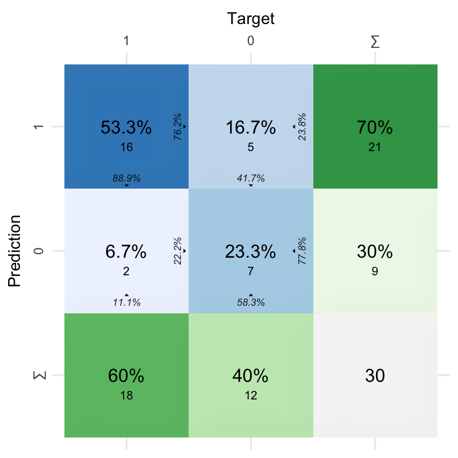

<!-- README.md is generated from README.Rmd. Please edit that file -->

# cvms <a href='https://github.com/LudvigOlsen/cvms'></a>

**Cross-Validation for Model Selection**  
**Authors:** [Ludvig R. Olsen](http://ludvigolsen.dk/) (
<r-pkgs@ludvigolsen.dk> ), Hugh Benjamin Zachariae <br/> **License:**
[MIT](https://opensource.org/licenses/MIT) <br/> **Started:** October
2016

[](https://cran.r-project.org/package=cvms)
[](https://cran.r-project.org/package=cvms)
[](https://cran.r-project.org/)
[](https://codecov.io/gh/ludvigolsen/cvms?branch=master)
[](https://travis-ci.org/LudvigOlsen/cvms)
[](https://ci.appveyor.com/project/LudvigOlsen/cvms)
[](https://zenodo.org/badge/latestdoi/71063931)

## Overview

R package for model evaluation and comparison.

  - **Cross-validate** one or multiple regression or classification
    models with relevant evaluation metrics in a **tidy** format.
  - **Validate** the best model on a test set and compare it to a
    **baseline** evaluation.
  - Perform **hyperparameter tuning** with *grid search*.
  - **Evaluate** predictions from an external model.
  - Extract the observations that were the **most challenging** to
    predict.

Currently supports regression (`'gaussian'`), binary classification
(`'binomial'`), and (some functions only) multiclass classification
(`'multinomial'`). Many of the functions allow **parallelization**,
e.g. through the `doParallel`
package.

### Main functions

| Function                                                                                      | Description                                                         |
| :-------------------------------------------------------------------------------------------- | :------------------------------------------------------------------ |
| `cross_validate()`                                                                            | Cross-validate linear models with `lm()`/`lmer()`/`glm()`/`glmer()` |
| `cross_validate_fn()`                                                                         | Cross-validate a custom model function                              |
| `validate()`                                                                                  | Validate linear models with (`lm`/`lmer`/`glm`/`glmer`)             |
| `validate_fn()`                                                                               | Validate a custom model function                                    |
| `evaluate()`                                                                                  | Evaluate predictions with a large set of metrics                    |
| `baseline()`</br>`baseline_gaussian()`</br>`baseline_binomial()`</br>`baseline_multinomial()` | Perform baseline evaluations of a dataset                           |

### Evaluation utilities

| Function               | Description                                                     |
| :--------------------- | :-------------------------------------------------------------- |
| `confusion_matrix()`   | Create a confusion matrix from predictions and targets          |
| `evaluate_residuals()` | Evaluate residuals from a regression task                       |
| `most_challenging()`   | Find the observations that were the most challenging to predict |
| `summarize_metrics()`  | Summarize numeric columns with a set of descriptors             |

### Formula utilities

| Function                 | Description                                             |
| :----------------------- | :------------------------------------------------------ |
| `combine_predictors()`   | Generate model formulas from a list of predictors       |
| `reconstruct_formulas()` | Extract formulas from output tibble                     |
| `simplify_formula()`     | Remove inline functions with more from a formula object |

### Plotting utilities

| Function                  | Description                                                                         |
| :------------------------ | :---------------------------------------------------------------------------------- |
| `plot_confusion_matrix()` | Plot a confusion matrix                                                             |
| `plot_metric_density()`   | Create a density plot for a metric column                                           |
| `font()`                  | Set font settings for plotting functions (currently only `plot_confusion_matrix()`) |

### Custom functions

| Function                   | Description                                            |
| :------------------------- | :----------------------------------------------------- |
| `model_functions()`        | Example model functions for `cross_validate_fn()`      |
| `predict_functions()`      | Example predict functions for `cross_validate_fn()`    |
| `preprocess_functions()`   | Example preprocess functions for `cross_validate_fn()` |
| `update_hyperparameters()` | Manage hyperparameters in custom model functions       |

### Other utilities

| Function                                                                    | Description                                              |
| :-------------------------------------------------------------------------- | :------------------------------------------------------- |
| `select_metrics()`                                                          | Select the metric columns from the output                |
| `select_definitions()`                                                      | Select the model-defining columns from the output        |
| `gaussian_metrics()`<br />`binomial_metrics()`<br />`multinomial_metrics()` | Create list of metrics for the common `metrics` argument |
| `multiclass_probability_tibble()`                                           | Generate a multiclass probability tibble                 |

### Datasets

| Name                       | Description                                                                               |
| :------------------------- | :---------------------------------------------------------------------------------------- |
| `participant.scores`       | Made-up experiment data with 10 participants and two diagnoses                            |
| `wines`                    | A list of wine varieties in an approximately Zipfian distribution                         |
| `musicians`                | Made-up data on 60 musicians in 4 groups for multiclass classification                    |
| `predicted.musicians`      | Predictions by 3 classifiers of the 4 classes in the `musicians` dataset                  |
| `precomputed.formulas`     | Fixed effect combinations for model formulas with/without two- and three-way interactions |
| `compatible.formula.terms` | 162,660 pairs of compatible terms for building model formulas with up to 15 fixed effects |

## Table of Contents

  - [cvms](#cvms)
      - [Overview](#overview)
          - [Main functions](#main-functions)
          - [Evaluation utilities](#evaluation-utilities)
          - [Formula utilities](#formula-utilities)
          - [Plotting utilities](#plotting-utilities)
          - [Custom functions](#custom-functions)
          - [Other utilities](#other-utilities)
          - [Datasets](#datasets)
      - [Important News](#important-news)
      - [Installation](#installation)
      - [Vignettes](#vignettes-)
  - [Examples](#examples)
      - [Attach packages](#attach-packages)
      - [Load data](#load-data)
      - [Fold data](#fold-data)
      - [Cross-validate a single model](#cross-validate-a-single-model)
          - [Gaussian](#gaussian)
          - [Binomial](#binomial)
      - [Cross-validate multiple
        models](#cross-validate-multiple-models)
          - [Create model formulas](#create-model-formulas)
          - [Cross-validate fixed effects
            models](#cross-validate-fixed-effects-models)
          - [Cross-validate mixed effects
            models](#cross-validate-mixed-effects-models)
      - [Repeated cross-validation](#repeated-cross-validation)
      - [Cross-validating custom model
        functions](#cross-validating-custom-model-functions)
          - [SVM](#svm)
          - [Naïve Bayes](#naïve-bayes)
      - [Extracting the most challenging
        observations](#extracting-the-most-challenging-observations)
      - [Evaluating predictions](#evaluating-predictions)
          - [Gaussian evaluation](#gaussian-evaluation)
          - [Binomial evaluation](#binomial-evaluation)
          - [Multinomial evaluation](#multinomial-evaluation)
      - [Baseline evaluations](#baseline-evaluations)
          - [Binomial baseline](#binomial-baseline)
          - [Multinomial baseline](#multinomial-baseline)
          - [Gaussian baseline](#gaussian-baseline)
      - [Generate model formulas](#generate-model-formulas)

## Important News

> Check `NEWS.md` for the full list of changes.

  - Version `1.0.0` contained **multiple breaking changes**. Please see
    `NEWS.md`. (13th of April 2020)

  - `cv_plot()` has been removed.

  - Fixes bug in `evaluate()`, when used on a grouped data frame. The
    row order in the output was not guaranteed to fit with the grouping
    keys. If you have used `evaluate()` on a grouped data frame, please
    rerun to make sure your results are correct\! (30th of November
    2019)

  - In `cross_validate()` and `validate()`, the `models` argument is
    renamed to `formulas` and the `model_verbose` argument is renamed to
    `verbose`. Further, the `link` argument is hard-deprecated and will
    throw an error if used.

  - `Multinomial AUC` is now calculated with `pROC::multiclass.roc`.

  - `cross_validate_fn()` and `validate_fn()` now take the
    `preprocess_fn`, `preprocess_once`, and `hyperparameters` arguments.
    The `predict_type` argument has been removed.

  - `cross_validate_fn()` and `validate_fn()` are added.
    (Cross-)validate custom model functions.

## Installation

CRAN:

> `install.packages("cvms")`

Development version:

> `install.packages("devtools")`
> 
> `devtools::install_github("LudvigOlsen/groupdata2")`
> 
> `devtools::install_github("LudvigOlsen/cvms")`

## Vignettes

`cvms` contains a number of vignettes with relevant use cases and
descriptions:

> `vignette(package = "cvms")` \# for an overview

# Examples

## Attach packages

``` r
library(cvms)
library(groupdata2)   # fold() partition()
library(knitr)        # kable()
library(dplyr)        # %>% arrange()
library(ggplot2)
```

## Load data

The dataset `participant.scores` comes with `cvms`:

``` r
data <- participant.scores
```

## Fold data

Create a grouping factor for subsetting of folds using
`groupdata2::fold()`. Order the dataset by the folds:

``` r
# Set seed for reproducibility
set.seed(7)

# Fold data 
data <- fold(
  data = data, k = 4,
  cat_col = 'diagnosis',
  id_col = 'participant') %>% 
  arrange(.folds)

# Show first 15 rows of data
data %>% head(15) %>% kable()
```

| participant | age | diagnosis | score | session | .folds |
| :---------- | --: | --------: | ----: | ------: | :----- |
| 9           |  34 |         0 |    33 |       1 | 1      |
| 9           |  34 |         0 |    53 |       2 | 1      |
| 9           |  34 |         0 |    66 |       3 | 1      |
| 8           |  21 |         1 |    16 |       1 | 1      |
| 8           |  21 |         1 |    32 |       2 | 1      |
| 8           |  21 |         1 |    44 |       3 | 1      |
| 2           |  23 |         0 |    24 |       1 | 2      |
| 2           |  23 |         0 |    40 |       2 | 2      |
| 2           |  23 |         0 |    67 |       3 | 2      |
| 1           |  20 |         1 |    10 |       1 | 2      |
| 1           |  20 |         1 |    24 |       2 | 2      |
| 1           |  20 |         1 |    45 |       3 | 2      |
| 6           |  31 |         1 |    14 |       1 | 2      |
| 6           |  31 |         1 |    25 |       2 | 2      |
| 6           |  31 |         1 |    30 |       3 | 2      |

## Cross-validate a single model

### Gaussian

``` r
CV1 <- cross_validate(
  data = data,
  formulas = "score ~ diagnosis",
  fold_cols = '.folds',
  family = 'gaussian',
  REML = FALSE
)

# Show results
CV1
#> # A tibble: 1 x 21
#>   Fixed  RMSE   MAE `NRMSE(IQR)`  RRSE   RAE RMSLE   AIC  AICc   BIC Predictions
#>   <chr> <dbl> <dbl>        <dbl> <dbl> <dbl> <dbl> <dbl> <dbl> <dbl> <list>     
#> 1 diag…  16.4  13.8        0.937 0.900 0.932 0.474  195.  196.  198. <tibble [3…
#> # … with 10 more variables: Results <list>, Coefficients <list>, Folds <int>,
#> #   `Fold Columns` <int>, `Convergence Warnings` <int>, `Singular Fit
#> #   Messages` <int>, `Other Warnings` <int>, `Warnings and Messages` <list>,
#> #   Family <chr>, Dependent <chr>

# Let's take a closer look at the different parts of the output 

# Metrics and formulas
CV1 %>% select_metrics() %>% kable()
```

| Fixed     |     RMSE |      MAE | NRMSE(IQR) |      RRSE |      RAE |     RMSLE |      AIC |     AICc |      BIC | Dependent |
| :-------- | -------: | -------: | ---------: | --------: | -------: | --------: | -------: | -------: | -------: | :-------- |
| diagnosis | 16.35261 | 13.75772 |  0.9373575 | 0.9004745 | 0.932284 | 0.4736577 | 194.6218 | 195.9276 | 197.9556 | score     |

``` r

# Just the formulas
CV1 %>% select_definitions() %>% kable()
```

| Dependent | Fixed     |
| :-------- | :-------- |
| score     | diagnosis |

``` r

# Nested predictions 
# Note that [[1]] picks predictions for the first row
CV1$Predictions[[1]] %>% head() %>% kable()
```

| Fold Column | Fold | Observation | Target | Prediction |
| :---------- | ---: | ----------: | -----: | ---------: |
| .folds      |    1 |           1 |     33 |   51.00000 |
| .folds      |    1 |           2 |     53 |   51.00000 |
| .folds      |    1 |           3 |     66 |   51.00000 |
| .folds      |    1 |           4 |     16 |   30.66667 |
| .folds      |    1 |           5 |     32 |   30.66667 |
| .folds      |    1 |           6 |     44 |   30.66667 |

``` r

# Nested results from the different folds
CV1$Results[[1]] %>% kable()
```

| Fold Column | Fold |     RMSE |      MAE | NRMSE(IQR) |      RRSE |       RAE |     RMSLE |      AIC |     AICc |      BIC |
| :---------- | ---: | -------: | -------: | ---------: | --------: | --------: | --------: | -------: | -------: | -------: |
| .folds      |    1 | 12.56760 | 10.72222 |  0.6793295 | 0.7825928 | 0.7845528 | 0.3555080 | 209.9622 | 211.1622 | 213.4963 |
| .folds      |    2 | 16.60767 | 14.77778 |  1.0379796 | 1.0090512 | 1.1271186 | 0.5805901 | 182.8739 | 184.2857 | 186.0075 |
| .folds      |    3 | 15.97355 | 12.87037 |  1.2528275 | 0.7954799 | 0.8644279 | 0.4767100 | 207.9074 | 209.1074 | 211.4416 |
| .folds      |    4 | 20.26162 | 16.66049 |  0.7792933 | 1.0147739 | 0.9530367 | 0.4818228 | 177.7436 | 179.1554 | 180.8772 |

``` r

# Nested model coefficients
# Note that you have the full p-values, 
# but kable() only shows a certain number of digits
CV1$Coefficients[[1]] %>% kable()
```

| Fold Column | Fold | term        |   estimate | std.error |  statistic |   p.value |
| :---------- | ---: | :---------- | ---------: | --------: | ---------: | --------: |
| .folds      |    1 | (Intercept) |   51.00000 |  5.901264 |   8.642216 | 0.0000000 |
| .folds      |    1 | diagnosis   | \-20.33333 |  7.464574 | \-2.723978 | 0.0123925 |
| .folds      |    2 | (Intercept) |   53.33333 |  5.718886 |   9.325826 | 0.0000000 |
| .folds      |    2 | diagnosis   | \-19.66667 |  7.565375 | \-2.599563 | 0.0176016 |
| .folds      |    3 | (Intercept) |   49.77778 |  5.653977 |   8.804030 | 0.0000000 |
| .folds      |    3 | diagnosis   | \-18.77778 |  7.151778 | \-2.625610 | 0.0154426 |
| .folds      |    4 | (Intercept) |   49.55556 |  5.061304 |   9.791065 | 0.0000000 |
| .folds      |    4 | diagnosis   | \-22.30556 |  6.695476 | \-3.331437 | 0.0035077 |

``` r

# Additional information about the model
# and the training process
CV1 %>% select(14:21) %>% kable()
```

| Folds | Fold Columns | Convergence Warnings | Singular Fit Messages | Other Warnings | Warnings and Messages                                                                                                       | Family   | Dependent |
| ----: | -----------: | -------------------: | --------------------: | -------------: | :-------------------------------------------------------------------------------------------------------------------------- | :------- | :-------- |
|     4 |            1 |                    0 |                     0 |              0 | list(`Fold Column` = character(0), Fold = integer(0), Function = character(0), Type = character(0), Message = character(0)) | gaussian | score     |

### Binomial

``` r
CV2 <- cross_validate(
  data = data,
  formulas = "diagnosis~score",
  fold_cols = '.folds',
  family = 'binomial'
)

# Show results
CV2
#> # A tibble: 1 x 29
#>   Fixed `Balanced Accur…    F1 Sensitivity Specificity `Pos Pred Value`
#>   <chr>            <dbl> <dbl>       <dbl>       <dbl>            <dbl>
#> 1 score            0.736 0.821       0.889       0.583            0.762
#> # … with 23 more variables: `Neg Pred Value` <dbl>, AUC <dbl>, `Lower
#> #   CI` <dbl>, `Upper CI` <dbl>, Kappa <dbl>, MCC <dbl>, `Detection
#> #   Rate` <dbl>, `Detection Prevalence` <dbl>, Prevalence <dbl>,
#> #   Predictions <list>, ROC <list>, `Confusion Matrix` <list>, Results <list>,
#> #   Coefficients <list>, Folds <int>, `Fold Columns` <int>, `Convergence
#> #   Warnings` <int>, `Singular Fit Messages` <int>, `Other Warnings` <int>,
#> #   `Warnings and Messages` <list>, `Positive Class` <chr>, Family <chr>,
#> #   Dependent <chr>

# Let's take a closer look at the different parts of the output 
# We won't repeat the parts too similar to those in Gaussian

# Metrics
CV2 %>% select(1:9) %>% kable(digits = 5)
```

| Fixed | Balanced Accuracy |      F1 | Sensitivity | Specificity | Pos Pred Value | Neg Pred Value |     AUC | Lower CI |
| :---- | ----------------: | ------: | ----------: | ----------: | -------------: | -------------: | ------: | -------: |
| score |           0.73611 | 0.82051 |     0.88889 |     0.58333 |         0.7619 |        0.77778 | 0.76852 |  0.59627 |

``` r
CV2 %>% select(10:15) %>% kable()
```

|  Upper CI |     Kappa |       MCC | Detection Rate | Detection Prevalence | Prevalence |
| --------: | --------: | --------: | -------------: | -------------------: | ---------: |
| 0.9407669 | 0.4927536 | 0.5048268 |      0.5333333 |                  0.7 |        0.6 |

``` r

# Confusion matrix
CV2$`Confusion Matrix`[[1]] %>% kable()
```

| Fold Column | Prediction | Target | Pos\_0 | Pos\_1 |  N |
| :---------- | :--------- | :----- | :----- | :----- | -: |
| .folds      | 0          | 0      | TP     | TN     |  7 |
| .folds      | 1          | 0      | FN     | FP     |  5 |
| .folds      | 0          | 1      | FP     | FN     |  2 |
| .folds      | 1          | 1      | TN     | TP     | 16 |

``` r

# Plot confusion matrix
plot_confusion_matrix(CV2$`Confusion Matrix`[[1]])
```



## Cross-validate multiple models

### Create model formulas

``` r
model_formulas <- c("score ~ diagnosis", "score ~ age")
mixed_model_formulas <- c("score ~ diagnosis + (1|session)",
                          "score ~ age + (1|session)")
```

### Cross-validate fixed effects models

``` r
CV3 <- cross_validate(
  data = data,
  formulas = model_formulas,
  fold_cols = '.folds',
  family = 'gaussian',
  REML = FALSE
)

# Show results
CV3
#> # A tibble: 2 x 21
#>   Fixed  RMSE   MAE `NRMSE(IQR)`  RRSE   RAE RMSLE   AIC  AICc   BIC Predictions
#>   <chr> <dbl> <dbl>        <dbl> <dbl> <dbl> <dbl> <dbl> <dbl> <dbl> <list>     
#> 1 diag…  16.4  13.8        0.937 0.900 0.932 0.474  195.  196.  198. <tibble [3…
#> 2 age    22.4  18.9        1.35  1.23  1.29  0.618  201.  202.  204. <tibble [3…
#> # … with 10 more variables: Results <list>, Coefficients <list>, Folds <int>,
#> #   `Fold Columns` <int>, `Convergence Warnings` <int>, `Singular Fit
#> #   Messages` <int>, `Other Warnings` <int>, `Warnings and Messages` <list>,
#> #   Family <chr>, Dependent <chr>
```

### Cross-validate mixed effects models

``` r
CV4 <- cross_validate(
  data = data,
  formulas = mixed_model_formulas,
  fold_cols = '.folds',
  family = 'gaussian',
  REML = FALSE
)

# Show results
CV4
#> # A tibble: 2 x 22
#>   Fixed  RMSE   MAE `NRMSE(IQR)`  RRSE   RAE RMSLE   AIC  AICc   BIC Predictions
#>   <chr> <dbl> <dbl>        <dbl> <dbl> <dbl> <dbl> <dbl> <dbl> <dbl> <list>     
#> 1 diag…  7.95  6.41        0.438 0.432 0.428 0.226  176.  178.  180. <tibble [3…
#> 2 age   17.5  16.2         1.08  0.953 1.11  0.480  194.  196.  198. <tibble [3…
#> # … with 11 more variables: Results <list>, Coefficients <list>, Folds <int>,
#> #   `Fold Columns` <int>, `Convergence Warnings` <int>, `Singular Fit
#> #   Messages` <int>, `Other Warnings` <int>, `Warnings and Messages` <list>,
#> #   Family <chr>, Dependent <chr>, Random <chr>
```

## Repeated cross-validation

Instead of only dividing our data into folds once, we can do it multiple
times and average the results. As the models can be ranked differently
with different splits, this is generally preferable.

Let’s first add some extra fold columns. We will use the `num_fold_cols`
argument to add 3 *unique* fold columns. We tell `fold()` to *keep* the
existing fold column and simply add three extra columns. We could also
choose to remove the existing fold column, if, for instance, we were
changing the number of folds (`k`). Note, that the original fold column
will be renamed to `".folds_1"`.

``` r
# Set seed for reproducibility
set.seed(2)

# Fold data 
data <- fold(
  data = data, k = 4,
  cat_col = 'diagnosis',
  id_col = 'participant',
  num_fold_cols = 3,
  handle_existing_fold_cols = "keep"
)

# Show first 15 rows of data
data %>% head(10) %>% kable()
```

| participant | age | diagnosis | score | session | .folds\_1 | .folds\_2 | .folds\_3 | .folds\_4 |
| :---------- | --: | --------: | ----: | ------: | :-------- | :-------- | :-------- | :-------- |
| 10          |  32 |         0 |    29 |       1 | 4         | 4         | 3         | 1         |
| 10          |  32 |         0 |    55 |       2 | 4         | 4         | 3         | 1         |
| 10          |  32 |         0 |    81 |       3 | 4         | 4         | 3         | 1         |
| 2           |  23 |         0 |    24 |       1 | 2         | 3         | 1         | 2         |
| 2           |  23 |         0 |    40 |       2 | 2         | 3         | 1         | 2         |
| 2           |  23 |         0 |    67 |       3 | 2         | 3         | 1         | 2         |
| 4           |  21 |         0 |    35 |       1 | 3         | 2         | 4         | 4         |
| 4           |  21 |         0 |    50 |       2 | 3         | 2         | 4         | 4         |
| 4           |  21 |         0 |    78 |       3 | 3         | 2         | 4         | 4         |
| 9           |  34 |         0 |    33 |       1 | 1         | 1         | 2         | 3         |

Now, let’s cross-validate the four fold columns. We use `paste0()` to
create the four column names:

``` r
CV5 <- cross_validate(
  data = data,
  formulas = c("diagnosis ~ score",
               "diagnosis ~ score + age"),
  fold_cols = paste0(".folds_", 1:4),
  family = 'binomial'
)

# Show results
CV5
#> # A tibble: 2 x 29
#>   Fixed `Balanced Accur…    F1 Sensitivity Specificity `Pos Pred Value`
#>   <chr>            <dbl> <dbl>       <dbl>       <dbl>            <dbl>
#> 1 score            0.729 0.813       0.875       0.583            0.759
#> 2 scor…            0.545 0.643       0.653       0.438            0.635
#> # … with 23 more variables: `Neg Pred Value` <dbl>, AUC <dbl>, `Lower
#> #   CI` <dbl>, `Upper CI` <dbl>, Kappa <dbl>, MCC <dbl>, `Detection
#> #   Rate` <dbl>, `Detection Prevalence` <dbl>, Prevalence <dbl>,
#> #   Predictions <list>, ROC <list>, `Confusion Matrix` <list>, Results <list>,
#> #   Coefficients <list>, Folds <int>, `Fold Columns` <int>, `Convergence
#> #   Warnings` <int>, `Singular Fit Messages` <int>, `Other Warnings` <int>,
#> #   `Warnings and Messages` <list>, `Positive Class` <chr>, Family <chr>,
#> #   Dependent <chr>

# Subset of the results per fold for the first model
CV5$Results[[1]] %>% select(1:8) %>% kable()
```

| Fold Column | Balanced Accuracy |        F1 | Sensitivity | Specificity | Pos Pred Value | Neg Pred Value |       AUC |
| :---------- | ----------------: | --------: | ----------: | ----------: | -------------: | -------------: | --------: |
| .folds\_1   |         0.7361111 | 0.8205128 |   0.8888889 |   0.5833333 |      0.7619048 |      0.7777778 | 0.7685185 |
| .folds\_2   |         0.7361111 | 0.8205128 |   0.8888889 |   0.5833333 |      0.7619048 |      0.7777778 | 0.7777778 |
| .folds\_3   |         0.7083333 | 0.7894737 |   0.8333333 |   0.5833333 |      0.7500000 |      0.7000000 | 0.7476852 |
| .folds\_4   |         0.7361111 | 0.8205128 |   0.8888889 |   0.5833333 |      0.7619048 |      0.7777778 | 0.7662037 |

## Cross-validating custom model functions

`cross_validate_fn()` allows us to cross-validate a custom model
function, like a support vector machine or a neural network. It works
with regression (`gaussian`), binary classification (`binomial`), and
multiclass classification (`multinomial`).

It is required to pass a model function and a predict function. Further,
it is possible to pass a preprocessing function and a list of
hyperparameter values to test with grid search. You can check the
requirements for these functions at `?cross_validate_fn`.

### SVM

Let’s cross-validate a support-vector machine using the `svm()` function
from the `e1071` package. First, we will create a model function. You
can do anything you want inside it, as long as it takes the arguments
`train_data`, `formula`, and `hyperparameters` and returns a fitted
model object:

``` r
# Create model function
#
# train_data : tibble with the training data
# formula : a formula object
# hyperparameters : a named list of hyparameters

svm_model_fn <- function(train_data, formula, hyperparameters){
  
  # Note that `formula` must be passed first
  # when calling svm(), otherwise it fails
  e1071::svm(
    formula = formula,
    data = train_data,
    kernel = "linear",
    type = "C-classification",
    probability = TRUE
  )
}
```

We also need a predict function. This will usually wrap the
`stats::predict()` function. The point is to ensure that the predictions
have the correct format. In this case, we want a single column with the
probability of the positive class. Note, that you do not need to use the
`formula`, `hyperparameters`, and `train_data` arguments within your
function. These are there for the few cases, where they are needed.

``` r
# Create predict function
#
# test_data : tibble with the test data
# model : fitted model object
# formula : a formula object
# hyperparameters : a named list of hyparameters
# train_data : tibble with the training data

svm_predict_fn <- function(test_data, model, formula, hyperparameters, train_data){
  
  # Predict the test set with the model
  predictions <- stats::predict(
    object = model,
    newdata = test_data,
    allow.new.levels = TRUE,
    probability = TRUE
  )

  # Extract the probabilities
  # Usually the predict function will just 
  # output the probabilities directly
  probabilities <- dplyr::as_tibble(
    attr(predictions, "probabilities")
  )

  # Return second column
  # with probabilities of positive class
  probabilities[[2]]
}
```

With these functions defined, we can cross-validate the support-vector
machine:

``` r
# Cross-validate svm_model_fn
CV6 <- cross_validate_fn(
  data = data,
  model_fn = svm_model_fn,
  predict_fn = svm_predict_fn,
  formulas = c("diagnosis ~ score", "diagnosis ~ age"),
  fold_cols = '.folds_1',
  type = 'binomial'
)
#> Will cross-validate 2 models. This requires fitting 8 model instances.

CV6
#> # A tibble: 2 x 28
#>   Fixed `Balanced Accur…    F1 Sensitivity Specificity `Pos Pred Value`
#>   <chr>            <dbl> <dbl>       <dbl>       <dbl>            <dbl>
#> 1 score            0.653 0.780       0.889       0.417            0.696
#> 2 age              0.458 0.615       0.667       0.25             0.571
#> # … with 22 more variables: `Neg Pred Value` <dbl>, AUC <dbl>, `Lower
#> #   CI` <dbl>, `Upper CI` <dbl>, Kappa <dbl>, MCC <dbl>, `Detection
#> #   Rate` <dbl>, `Detection Prevalence` <dbl>, Prevalence <dbl>,
#> #   Predictions <list>, ROC <list>, `Confusion Matrix` <list>, Results <list>,
#> #   Coefficients <list>, Folds <int>, `Fold Columns` <int>, `Convergence
#> #   Warnings` <int>, `Other Warnings` <int>, `Warnings and Messages` <list>,
#> #   `Positive Class` <chr>, Family <chr>, Dependent <chr>
```

### Naïve Bayes

Let’s try with a naïve Bayes classifier as well. First, we will define
the model function:

``` r
# Create model function
#
# train_data : tibble with the training data
# formula : a formula object
# hyperparameters : a named list of hyparameters

nb_model_fn <- function(train_data, formula, hyperparameters){
  e1071::naiveBayes(
    formula = formula,
    data = train_data
  )
}
```

And the predict function:

``` r
# Create predict function
#
# test_data : tibble with the test data
# model : fitted model object
# formula : a formula object
# hyperparameters : a named list of hyparameters
# train_data : tibble with the training data

nb_predict_fn <- function(test_data, model, formula, hyperparameters, train_data){
  stats::predict(
    object = model,
    newdata = test_data,
    type = "raw",
    allow.new.levels = TRUE)[, 2]
}
```

With both functions specified, we are ready to cross-validate our naïve
Bayes classifier:

``` r
CV7 <- cross_validate_fn(
  data = data,
  model_fn = nb_model_fn,
  predict_fn = nb_predict_fn,
  formulas = c("diagnosis ~ score", "diagnosis ~ age"),
  type = 'binomial',
  fold_cols = '.folds_1'
)
#> Will cross-validate 2 models. This requires fitting 8 model instances.

CV7
#> # A tibble: 2 x 28
#>   Fixed `Balanced Accur…    F1 Sensitivity Specificity `Pos Pred Value`
#>   <chr>            <dbl> <dbl>       <dbl>       <dbl>            <dbl>
#> 1 score            0.736 0.821       0.889       0.583            0.762
#> 2 age              0.25  0.462       0.5         0                0.429
#> # … with 22 more variables: `Neg Pred Value` <dbl>, AUC <dbl>, `Lower
#> #   CI` <dbl>, `Upper CI` <dbl>, Kappa <dbl>, MCC <dbl>, `Detection
#> #   Rate` <dbl>, `Detection Prevalence` <dbl>, Prevalence <dbl>,
#> #   Predictions <list>, ROC <list>, `Confusion Matrix` <list>, Results <list>,
#> #   Coefficients <list>, Folds <int>, `Fold Columns` <int>, `Convergence
#> #   Warnings` <int>, `Other Warnings` <int>, `Warnings and Messages` <list>,
#> #   `Positive Class` <chr>, Family <chr>, Dependent <chr>
```

## Extracting the most challenging observations

If we wish to investigate why some observations are harder to predict
than others, we should start by identifying the most challenging
observations. This can be done with `most_challenging()`.

Let’s first extract the predictions from some of the cross-validation
results:

``` r
glm_predictions <- dplyr::bind_rows(CV5$Predictions, .id = "Model")
svm_predictions <- dplyr::bind_rows(CV6$Predictions, .id = "Model")
nb_predictions <- dplyr::bind_rows(CV7$Predictions, .id = "Model")
predictions <- dplyr::bind_rows(
  glm_predictions, 
  svm_predictions, 
  nb_predictions, 
  .id = "Architecture"
)
predictions[["Target"]] <- as.character(predictions[["Target"]])

predictions
#> # A tibble: 360 x 8
#>    Architecture Model `Fold Column`  Fold Observation Target Prediction
#>    <chr>        <chr> <chr>         <int>       <int> <chr>       <dbl>
#>  1 1            1     .folds_1          1          10 0           0.721
#>  2 1            1     .folds_1          1          11 0           0.422
#>  3 1            1     .folds_1          1          12 0           0.242
#>  4 1            1     .folds_1          1          28 1           0.884
#>  5 1            1     .folds_1          1          29 1           0.734
#>  6 1            1     .folds_1          1          30 1           0.563
#>  7 1            1     .folds_1          2           4 0           0.831
#>  8 1            1     .folds_1          2           5 0           0.620
#>  9 1            1     .folds_1          2           6 0           0.202
#> 10 1            1     .folds_1          2          13 1           0.928
#> # … with 350 more rows, and 1 more variable: `Predicted Class` <chr>
```

Now, let’s find the *overall most difficult to predict* observations.
`most_challenging()` calculates the `Accuracy`, `MAE`, and
`Cross-Entropy` for each prediction. We can then extract the
observations with the ~20% highest `MAE` scores. Note that
`most_challenging()` works with grouped data frames as well.

``` r
challenging <- most_challenging(
  data = predictions,
  prediction_cols = "Prediction",
  type = "binomial",
  threshold = 0.20,
  threshold_is = "percentage"
)

challenging
#> # A tibble: 6 x 7
#>   Observation Correct Incorrect Accuracy   MAE `Cross Entropy`  `<=`
#>         <int>   <int>     <int>    <dbl> <dbl>           <dbl> <dbl>
#> 1          21       1        11   0.0833 0.820            2.10 0.615
#> 2           4       0        12   0      0.783            1.66 0.615
#> 3          10       0        12   0      0.774            1.57 0.615
#> 4          20       1        11   0.0833 0.742            1.50 0.615
#> 5           1       1        11   0.0833 0.733            1.39 0.615
#> 6           7       0        12   0      0.690            1.22 0.615
```

We can then extract the difficult observations from the dataset. First,
we add an index to the dataset. Then, we perform a right-join, to only
get the rows that are in the `challenging` data frame.

``` r
# Index with values 1:30
data[["Observation"]] <- seq_len(nrow(data))

# Add information to the challenging observations
challenging <- data %>% 
  # Remove fold columns for clarity
  dplyr::select(-c(.folds_1, .folds_2, .folds_3, .folds_4)) %>% 
  # Add the scores
  dplyr::right_join(challenging, by = "Observation")

challenging %>% kable()
```

| participant | age | diagnosis | score | session | Observation | Correct | Incorrect |  Accuracy |       MAE | Cross Entropy |       \<= |
| :---------- | --: | --------: | ----: | ------: | ----------: | ------: | --------: | --------: | --------: | ------------: | --------: |
| 5           |  32 |         1 |    62 |       3 |          21 |       1 |        11 | 0.0833333 | 0.8199538 |      2.097782 | 0.6145233 |
| 2           |  23 |         0 |    24 |       1 |           4 |       0 |        12 | 0.0000000 | 0.7832189 |      1.664472 | 0.6145233 |
| 9           |  34 |         0 |    33 |       1 |          10 |       0 |        12 | 0.0000000 | 0.7735253 |      1.568240 | 0.6145233 |
| 5           |  32 |         1 |    54 |       2 |          20 |       1 |        11 | 0.0833333 | 0.7419556 |      1.497591 | 0.6145233 |
| 10          |  32 |         0 |    29 |       1 |           1 |       1 |        11 | 0.0833333 | 0.7333863 |      1.390259 | 0.6145233 |
| 4           |  21 |         0 |    35 |       1 |           7 |       0 |        12 | 0.0000000 | 0.6896729 |      1.218275 | 0.6145233 |

Note: You may have to scroll to the right in the table.

## Evaluating predictions

We can also evaluate predictions from a model trained outside `cvms`.
This works with regression (`'gaussian'`), binary classification
(`'binomial'`), and multiclass classification (`'multinomial'`).

### Gaussian evaluation

Extract the targets and predictions from the first cross-validation we
performed and evaluate it with `evaluate()`. We group the data frame by
the `Fold` column to evaluate each fold separately:

``` r
# Extract the predictions from the first cross-validation
predictions <- CV1$Predictions[[1]] 
predictions %>% head(6) %>% kable()
```

| Fold Column | Fold | Observation | Target | Prediction |
| :---------- | ---: | ----------: | -----: | ---------: |
| .folds      |    1 |           1 |     33 |   51.00000 |
| .folds      |    1 |           2 |     53 |   51.00000 |
| .folds      |    1 |           3 |     66 |   51.00000 |
| .folds      |    1 |           4 |     16 |   30.66667 |
| .folds      |    1 |           5 |     32 |   30.66667 |
| .folds      |    1 |           6 |     44 |   30.66667 |

``` r

# Evaluate the predictions per fold
predictions %>% 
  group_by(Fold) %>% 
  evaluate(
    target_col = "Target",
    prediction_cols = "Prediction",
    type = "gaussian"
  )
#> # A tibble: 4 x 8
#>    Fold  RMSE   MAE `NRMSE(IQR)`  RRSE   RAE RMSLE Predictions     
#>   <int> <dbl> <dbl>        <dbl> <dbl> <dbl> <dbl> <list>          
#> 1     1  12.6  10.7        0.679 0.783 0.785 0.356 <tibble [6 × 3]>
#> 2     2  16.6  14.8        1.04  1.01  1.13  0.581 <tibble [9 × 3]>
#> 3     3  16.0  12.9        1.25  0.795 0.864 0.477 <tibble [6 × 3]>
#> 4     4  20.3  16.7        0.779 1.01  0.953 0.482 <tibble [9 × 3]>
```

### Binomial evaluation

We can do the same for the predictions from the second, binomial
cross-validation:

``` r
# Extract the predictions from the second cross-validation
predictions <- CV2$Predictions[[1]] 
predictions %>% head(6) %>% kable()
```

| Fold Column | Fold | Observation | Target | Prediction | Predicted Class |
| :---------- | ---: | ----------: | -----: | ---------: | :-------------- |
| .folds      |    1 |           1 |      0 |  0.7214054 | 1               |
| .folds      |    1 |           2 |      0 |  0.4216125 | 0               |
| .folds      |    1 |           3 |      0 |  0.2423024 | 0               |
| .folds      |    1 |           4 |      1 |  0.8837986 | 1               |
| .folds      |    1 |           5 |      1 |  0.7339631 | 1               |
| .folds      |    1 |           6 |      1 |  0.5632255 | 1               |

``` r

# Evaluate the predictions per fold
predictions %>% 
  group_by(Fold) %>% 
  evaluate(
    target_col = "Target",
    prediction_cols = "Prediction",
    type = "binomial"
  )
#> # A tibble: 4 x 19
#>    Fold `Balanced Accur…    F1 Sensitivity Specificity `Pos Pred Value`
#>   <int>            <dbl> <dbl>       <dbl>       <dbl>            <dbl>
#> 1     1            0.833 0.857       1           0.667             0.75
#> 2     2            0.667 0.857       1           0.333             0.75
#> 3     3            0.833 0.857       1           0.667             0.75
#> 4     4            0.667 0.727       0.667       0.667             0.8 
#> # … with 13 more variables: `Neg Pred Value` <dbl>, AUC <dbl>, `Lower
#> #   CI` <dbl>, `Upper CI` <dbl>, Kappa <dbl>, MCC <dbl>, `Detection
#> #   Rate` <dbl>, `Detection Prevalence` <dbl>, Prevalence <dbl>,
#> #   Predictions <list>, ROC <list>, `Confusion Matrix` <list>, `Positive
#> #   Class` <chr>
```

### Multinomial evaluation

We will use the `multiclass_probability_tibble()` helper to generate a
data frame with predicted probabilities for three classes, along with
the predicted class and the target class. Then, we will 1) evaluate the
three probability columns against the targets (preferable format), and
2) evaluate the predicted classes against the targets:

``` r
# Create dataset for multinomial evaluation
multiclass_data <- multiclass_probability_tibble(
  num_classes = 3, # Here, number of predictors
  num_observations = 30,
  apply_softmax = TRUE,
  add_predicted_classes = TRUE,
  add_targets = TRUE) 

multiclass_data
#> # A tibble: 30 x 5
#>    class_1 class_2 class_3 `Predicted Class` Target 
#>      <dbl>   <dbl>   <dbl> <chr>             <chr>  
#>  1   0.200   0.490   0.309 class_2           class_2
#>  2   0.256   0.255   0.489 class_3           class_2
#>  3   0.255   0.423   0.322 class_2           class_2
#>  4   0.391   0.316   0.293 class_1           class_2
#>  5   0.314   0.364   0.321 class_2           class_1
#>  6   0.258   0.449   0.293 class_2           class_1
#>  7   0.406   0.173   0.421 class_3           class_3
#>  8   0.317   0.273   0.410 class_3           class_1
#>  9   0.351   0.227   0.422 class_3           class_3
#> 10   0.373   0.395   0.233 class_2           class_2
#> # … with 20 more rows

# Evaluate probabilities
# One prediction column *per class*
ev <- evaluate(
  data = multiclass_data,
  target_col = "Target",
  prediction_cols = paste0("class_", 1:3),
  type = "multinomial"
)

ev
#> # A tibble: 1 x 15
#>   `Overall Accura… `Balanced Accur…    F1 Sensitivity Specificity
#>              <dbl>            <dbl> <dbl>       <dbl>       <dbl>
#> 1            0.533            0.646 0.516       0.530       0.762
#> # … with 10 more variables: `Pos Pred Value` <dbl>, `Neg Pred Value` <dbl>,
#> #   Kappa <dbl>, MCC <dbl>, `Detection Rate` <dbl>, `Detection
#> #   Prevalence` <dbl>, Prevalence <dbl>, Predictions <list>, `Confusion
#> #   Matrix` <list>, `Class Level Results` <list>

# The one-vs-all evaluations
ev$`Class Level Results`[[1]]
#> # A tibble: 3 x 13
#>   Class `Balanced Accur…    F1 Sensitivity Specificity `Pos Pred Value`
#>   <chr>            <dbl> <dbl>       <dbl>       <dbl>            <dbl>
#> 1 clas…            0.659 0.526       0.556       0.762            0.5  
#> 2 clas…            0.633 0.593       0.533       0.733            0.667
#> 3 clas…            0.646 0.429       0.5         0.792            0.375
#> # … with 7 more variables: `Neg Pred Value` <dbl>, Kappa <dbl>, `Detection
#> #   Rate` <dbl>, `Detection Prevalence` <dbl>, Prevalence <dbl>, Support <int>,
#> #   `Confusion Matrix` <list>

# Evaluate the predicted classes
# One prediction column with the class names
evaluate(
  data = multiclass_data,
  target_col = "Target",
  prediction_cols = "Predicted Class",
  type = "multinomial"
)
#> # A tibble: 1 x 15
#>   `Overall Accura… `Balanced Accur…    F1 Sensitivity Specificity
#>              <dbl>            <dbl> <dbl>       <dbl>       <dbl>
#> 1            0.533            0.646 0.516       0.530       0.762
#> # … with 10 more variables: `Pos Pred Value` <dbl>, `Neg Pred Value` <dbl>,
#> #   Kappa <dbl>, MCC <dbl>, `Detection Rate` <dbl>, `Detection
#> #   Prevalence` <dbl>, Prevalence <dbl>, Predictions <list>, `Confusion
#> #   Matrix` <list>, `Class Level Results` <list>
```

## Baseline evaluations

While it’s common to find the chance-level baseline analytically (in
classification tasks), it’s often possible to get a better evaluation
than that by chance. Hence, it is useful to check the range of our
metrics when randomly guessing the probabilities.

Usually, we use `baseline()` on our test set at the start of our
modeling process, so we know what level of performance we should beat.

Note: Where `baseline()` works with all three families (`gaussian`,
`binomial` and `multinomial`), each family also has a wrapper function
(e.g. `baseline_gaussian()`) that is easier to use. We use those here.

Start by partitioning the dataset:

``` r
# Set seed for reproducibility
set.seed(1)

# Partition the dataset 
partitions <- groupdata2::partition(
  participant.scores,
  p = 0.7,
  cat_col = 'diagnosis',
  id_col = 'participant',
  list_out = TRUE
)

train_set <- partitions[[1]]
test_set <- partitions[[2]]
```

### Binomial baseline

Approach: `n` random sets of predictions are evaluated against the
dependent variable in the test set. We also evaluate a set of all `0`s
and a set of all `1`s.

Create the baseline evaluations:

``` r
# Perform binomial baseline evaluation
# Note: It's worth enabling parallelization (see ?baseline examples)
binomial_baseline <- baseline_binomial(
  test_data = test_set, 
  dependent_col = "diagnosis",
  n = 100
)

binomial_baseline$summarized_metrics
#> # A tibble: 10 x 15
#>    Measure `Balanced Accur…      F1 Sensitivity Specificity `Pos Pred Value`
#>    <chr>              <dbl>   <dbl>       <dbl>       <dbl>            <dbl>
#>  1 Mean               0.496   0.481       0.475       0.517            0.494
#>  2 Median             0.5     0.5         0.5         0.5              0.5  
#>  3 SD                 0.130   0.144       0.178       0.181            0.146
#>  4 IQR                0.167   0.195       0.208       0.333            0.200
#>  5 Max                0.833   0.833       0.833       0.833            0.833
#>  6 Min                0.25    0.182       0           0.167            0    
#>  7 NAs                0       1           0           0                0    
#>  8 INFs               0       0           0           0                0    
#>  9 All_0              0.5   NaN           0           1              NaN    
#> 10 All_1              0.5     0.667       1           0                0.5  
#> # … with 9 more variables: `Neg Pred Value` <dbl>, AUC <dbl>, `Lower CI` <dbl>,
#> #   `Upper CI` <dbl>, Kappa <dbl>, MCC <dbl>, `Detection Rate` <dbl>,
#> #   `Detection Prevalence` <dbl>, Prevalence <dbl>
```

On average, we can expect an `F1` score of approximately `0.481`. The
maximum `F1` score achieved by randomly guessing was `0.833` though.
That’s likely because of the small size of the test set, but it
illustrates how such information could be useful in a real-life
scenario.

The `All_1` row shows us that we can achieve an `F1` score of `0.667` by
always predicting `1`. Some model architectures, like neural networks,
have a tendency to always predict the majority class. Such a model is
quite useless of course, why it is good to be aware of the performance
it could achieve. We could also check the confusion matrix for such a
pattern.

``` r
binomial_baseline$random_evaluations
#> # A tibble: 100 x 20
#>    `Balanced Accur…    F1 Sensitivity Specificity `Pos Pred Value`
#>               <dbl> <dbl>       <dbl>       <dbl>            <dbl>
#>  1            0.417 0.462       0.5         0.333            0.429
#>  2            0.667 0.6         0.5         0.833            0.75 
#>  3            0.5   0.571       0.667       0.333            0.5  
#>  4            0.417 0.364       0.333       0.5              0.4  
#>  5            0.583 0.545       0.5         0.667            0.6  
#>  6            0.583 0.545       0.5         0.667            0.6  
#>  7            0.667 0.667       0.667       0.667            0.667
#>  8            0.417 0.364       0.333       0.5              0.4  
#>  9            0.333 0.333       0.333       0.333            0.333
#> 10            0.583 0.545       0.5         0.667            0.6  
#> # … with 90 more rows, and 15 more variables: `Neg Pred Value` <dbl>,
#> #   AUC <dbl>, `Lower CI` <dbl>, `Upper CI` <dbl>, Kappa <dbl>, MCC <dbl>,
#> #   `Detection Rate` <dbl>, `Detection Prevalence` <dbl>, Prevalence <dbl>,
#> #   Predictions <list>, ROC <list>, `Confusion Matrix` <list>, `Positive
#> #   Class` <chr>, Family <chr>, Dependent <chr>
```

We can plot the distribution of `F1` scores from the random evaluations:

``` r
# First, remove the NAs from the F1 column
random_evaluations <- binomial_baseline$random_evaluations
random_evaluations <- random_evaluations[!is.na(random_evaluations$F1),]

# Create density plot for F1
plot_metric_density(baseline = random_evaluations, 
                    metric = "F1", xlim = c(0, 1))
```


### Multinomial baseline

Approach: Creates one-vs-all (binomial) baseline evaluations for `n`
sets of random predictions against the dependent variable, along with
sets of `all class x,y,z,...` predictions.

Create the baseline evaluations:

``` r

multiclass_baseline <- baseline_multinomial(
  test_data = multiclass_data, 
  dependent_col = "Target",
  n = 100
)

# Summarized metrics
multiclass_baseline$summarized_metrics
#> # A tibble: 15 x 13
#>    Measure `Overall Accura… `Balanced Accur…       F1 Sensitivity Specificity
#>    <chr>              <dbl>            <dbl>    <dbl>       <dbl>       <dbl>
#>  1 Mean              0.330            0.497    0.324       0.329       0.665 
#>  2 Median            0.333            0.496    0.325       0.330       0.659 
#>  3 SD                0.0823           0.0662   0.0760      0.0904      0.0445
#>  4 IQR               0.108            0.0897   0.0987      0.123       0.0669
#>  5 Max               0.5              0.664    0.499       0.556       0.773 
#>  6 Min               0.133            0.352    0.131       0.137       0.562 
#>  7 NAs               0                0       10           0           0     
#>  8 INFs              0                0        0           0           0     
#>  9 CL_Max           NA                0.770    0.688       0.833       0.933 
#> 10 CL_Min           NA                0.286    0.0870      0           0.286 
#> 11 CL_NAs           NA                0       10           0           0     
#> 12 CL_INFs          NA                0        0           0           0     
#> 13 All_cl…           0.3              0.5    NaN           0.333       0.667 
#> 14 All_cl…           0.5              0.5    NaN           0.333       0.667 
#> 15 All_cl…           0.2              0.5    NaN           0.333       0.667 
#> # … with 7 more variables: `Pos Pred Value` <dbl>, `Neg Pred Value` <dbl>,
#> #   Kappa <dbl>, MCC <dbl>, `Detection Rate` <dbl>, `Detection
#> #   Prevalence` <dbl>, Prevalence <dbl>
```

The `CL_` measures describe the `Class Level Results` (aka. one-vs-all
evaluations). One of the classes have a maximum `Balanced Accuracy`
score of `0.770`, while the maximum `Balanced Accuracy` in the random
evaluations is `0.664`.

``` r

# Summarized class level results for class 1
multiclass_baseline$summarized_class_level_results %>% 
  dplyr::filter(Class == "class_1") %>%
  tidyr::unnest(Results)
#> # A tibble: 10 x 12
#>    Class Measure `Balanced Accur…      F1 Sensitivity Specificity
#>    <chr> <chr>              <dbl>   <dbl>       <dbl>       <dbl>
#>  1 clas… Mean              0.493    0.314       0.339       0.648
#>  2 clas… Median            0.472    0.3         0.333       0.667
#>  3 clas… SD                0.0933   0.119       0.148       0.103
#>  4 clas… IQR               0.127    0.159       0.222       0.143
#>  5 clas… Max               0.770    0.667       0.778       0.905
#>  6 clas… Min               0.286    0.105       0           0.286
#>  7 clas… NAs               0        1           0           0    
#>  8 clas… INFs              0        0           0           0    
#>  9 clas… All_0             0.5    NaN           0           1    
#> 10 clas… All_1             0.5      0.462       1           0    
#> # … with 6 more variables: `Pos Pred Value` <dbl>, `Neg Pred Value` <dbl>,
#> #   Kappa <dbl>, `Detection Rate` <dbl>, `Detection Prevalence` <dbl>,
#> #   Prevalence <dbl>

# Random evaluations
# Note, that the class level results for each repetition
# are available as well
multiclass_baseline$random_evaluations
#> # A tibble: 100 x 18
#>    Repetition `Overall Accura… `Balanced Accur…      F1 Sensitivity Specificity
#>         <int>            <dbl>            <dbl>   <dbl>       <dbl>       <dbl>
#>  1          1            0.2              0.401 NaN           0.207       0.594
#>  2          2            0.233            0.427   0.239       0.252       0.602
#>  3          3            0.433            0.564   0.410       0.415       0.712
#>  4          4            0.367            0.529   0.352       0.356       0.702
#>  5          5            0.167            0.394   0.161       0.189       0.600
#>  6          6            0.333            0.496   0.314       0.319       0.673
#>  7          7            0.4              0.534   0.359       0.363       0.705
#>  8          8            0.467            0.608   0.462       0.485       0.731
#>  9          9            0.3              0.476   0.286       0.296       0.655
#> 10         10            0.267            0.430   0.261       0.259       0.602
#> # … with 90 more rows, and 12 more variables: `Pos Pred Value` <dbl>, `Neg Pred
#> #   Value` <dbl>, Kappa <dbl>, MCC <dbl>, `Detection Rate` <dbl>, `Detection
#> #   Prevalence` <dbl>, Prevalence <dbl>, Predictions <list>, `Confusion
#> #   Matrix` <list>, `Class Level Results` <list>, Family <chr>, Dependent <chr>
```

### Gaussian baseline

Approach: The baseline model `(y ~ 1)`, where `1` is simply the
intercept (i.e. mean of `y`), is fitted on `n` random subsets of the
training set and evaluated on the test set. We also perform an
evaluation of the model fitted on the entire training set.

We usually wish to establish whether our predictors add anything useful
to our model. We should thus at least do better than a model without any
predictors.

Create the baseline evaluations:

``` r
gaussian_baseline <- baseline_gaussian(
  test_data = test_set,
  train_data = train_set,
  dependent_col = "score",
  n = 100
)

gaussian_baseline$summarized_metrics
#> # A tibble: 9 x 8
#>   Measure    RMSE      MAE `NRMSE(IQR)`   RRSE      RAE  RMSLE `Training Rows`
#>   <chr>     <dbl>    <dbl>        <dbl>  <dbl>    <dbl>  <dbl>           <dbl>
#> 1 Mean     19.6   15.8           0.944  1.04   1.02     0.559             9.88
#> 2 Median   19.2   15.5           0.925  1.01   1        0.548            10   
#> 3 SD        1.19   0.941         0.0575 0.0630 0.0607   0.0303            3.31
#> 4 IQR       0.682  0.00321       0.0328 0.0360 0.000207 0.0189            6   
#> 5 Max      26.8   21.8           1.29   1.42   1.41     0.727            15   
#> 6 Min      18.9   15.5           0.912  1.00   1        0.541             5   
#> 7 NAs       0      0             0      0      0        0                 0   
#> 8 INFs      0      0             0      0      0        0                 0   
#> 9 All_rows 19.1   15.5           0.923  1.01   1        0.543            18
```

The `All_rows` row tells us the performance when fitting the intercept
model on the full training set. It is quite close to the mean of the
random evaluations.

``` r
gaussian_baseline$random_evaluations
#> # A tibble: 100 x 12
#>     RMSE   MAE `NRMSE(IQR)`  RRSE   RAE RMSLE Predictions Coefficients
#>    <dbl> <dbl>        <dbl> <dbl> <dbl> <dbl> <list>      <list>      
#>  1  19.1  15.5        0.921  1.01  1    0.544 <tibble [1… <tibble [1 …
#>  2  19.2  15.5        0.926  1.02  1    0.543 <tibble [1… <tibble [1 …
#>  3  19.0  15.5        0.917  1.01  1    0.568 <tibble [1… <tibble [1 …
#>  4  19.0  15.5        0.916  1.00  1    0.566 <tibble [1… <tibble [1 …
#>  5  19.2  15.5        0.927  1.02  1    0.542 <tibble [1… <tibble [1 …
#>  6  19.5  15.5        0.937  1.03  1    0.541 <tibble [1… <tibble [1 …
#>  7  20.4  15.9        0.983  1.08  1.02 0.546 <tibble [1… <tibble [1 …
#>  8  18.9  15.5        0.912  1.00  1    0.558 <tibble [1… <tibble [1 …
#>  9  19.5  15.5        0.939  1.03  1    0.541 <tibble [1… <tibble [1 …
#> 10  18.9  15.5        0.912  1.00  1    0.558 <tibble [1… <tibble [1 …
#> # … with 90 more rows, and 4 more variables: `Training Rows` <int>,
#> #   Family <chr>, Dependent <chr>, Fixed <chr>
```

Plot the density plot for `RMSE`:

``` r
plot_metric_density(baseline = gaussian_baseline$random_evaluations,
                    metric = "RMSE")
```


In this instance, the `All_rows` row might have been enough, as the
subsets mainly add higher `RMSE` scores.

## Generate model formulas

Instead of manually typing all possible model formulas for a set of
fixed effects (including the possible interactions),
`combine_predictors()` can do it for you (with some constraints).

When including interactions, \>200k formulas have been precomputed for
up to 8 fixed effects, with a maximum interaction size of 3, and a
maximum of 5 fixed effects per formula. It’s possible to further limit
the generated formulas.

We can also append a random effects structure to the generated formulas.

``` r
combine_predictors(
  dependent = "y",
  fixed_effects = c("a", "b", "c"),
  random_effects = "(1|d)"
)
#>  [1] "y ~ a + (1|d)"                     "y ~ b + (1|d)"                    
#>  [3] "y ~ c + (1|d)"                     "y ~ a * b + (1|d)"                
#>  [5] "y ~ a * c + (1|d)"                 "y ~ a + b + (1|d)"                
#>  [7] "y ~ a + c + (1|d)"                 "y ~ b * c + (1|d)"                
#>  [9] "y ~ b + c + (1|d)"                 "y ~ a * b * c + (1|d)"            
#> [11] "y ~ a * b + c + (1|d)"             "y ~ a * c + b + (1|d)"            
#> [13] "y ~ a + b * c + (1|d)"             "y ~ a + b + c + (1|d)"            
#> [15] "y ~ a * b + a * c + (1|d)"         "y ~ a * b + b * c + (1|d)"        
#> [17] "y ~ a * c + b * c + (1|d)"         "y ~ a * b + a * c + b * c + (1|d)"
```

If two or more fixed effects should not be in the same formula, like an
effect and its log-transformed version, we can provide them as sublists.

``` r
combine_predictors(
  dependent = "y",
  fixed_effects = list("a", list("b", "log_b")),
  random_effects = "(1|d)"
)
#> [1] "y ~ a + (1|d)"         "y ~ b + (1|d)"         "y ~ log_b + (1|d)"    
#> [4] "y ~ a * b + (1|d)"     "y ~ a * log_b + (1|d)" "y ~ a + b + (1|d)"    
#> [7] "y ~ a + log_b + (1|d)"
```
